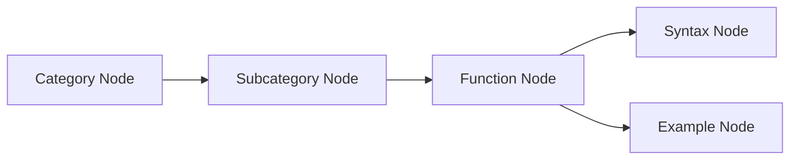

---
!!python/object/apply:collections.OrderedDict
- - - categories
    - []
  - - subCategories
    - []
  - - topics
    - []
  - - subTopics
    - []
  - - dateCreated
    - 2025-06-16
  - - dateRevised
    - 2025-06-16
  - - aliases
    - - "\U0001F4CA CLAUDE.MD - Excel & Google Sheets Functions Visual Reference"
  - - tags
    - []
---
# 📊 CLAUDE.MD - Excel & Google Sheets Functions Visual Reference
## Project Overview
A comprehensive visual documentation system for all 546 Excel and Google Sheets functions using Mermaid.js diagrams, optimized for Obsidian.md and knowledge management systems. This project transforms complex spreadsheet function documentation into accessible, interactive visual references.
## Key Features
### Complete Coverage
- 546 Functions documented across 15 major categories
- Excel & Google Sheets platform coverage
- Syntax & Examples for every function
- Cross-platform compatibility notes

### Professional Design
- Consistent Visual Language with color-coded categories
- MonoLisa Typography optimized for technical documentation
- Obsidian.md Integration with wiki-style `[[]]` linking
- Mermaid.js Diagrams for interactive exploration

### Educational Structure
- Hierarchical Organization: Category → Subcategory → Function → Syntax → Example
- Visual Learning through flowchart diagrams
- Practical Examples with real-world applications
- Progressive Complexity from basic to advanced functions

## Project Structure

```javascript

/Spreadsheets-Diagrams/
├── Database Functions (12)
│   └── Aggregation functions (DAVERAGE, DCOUNT, etc.)
├── Financial Functions (54)
│   ├── Investment Analysis (44)
│   ├── Depreciation (5)
│   ├── Loan Calculations (4)
│   └── Currency (1)
├── ⚙️ Engineering Functions (54)
│   ├── Bitwise Operations (5)
│   ├── Complex Numbers (26)
│   ├── Engineering Calculations (11)
│   └── Number Conversion (12)
├── Math & Trigonometry (73)
│   ├── Basic Arithmetic (18)
│   ├── Trigonometry (21)
│   ├── Advanced Math (24)
│   ├── Matrix Operations (4)
│   ├── Random Numbers (3)
│   ├── Constants (1)
│   └── New Functions (2)
├── Text Functions (41)
│   ├── Conversion (13)
│   ├── String Manipulation (10)
│   ├── Formatting (10)
│   ├── Search & Replace (4)
│   ├── Regex (3)
│   └── New Functions (1)
├── Information Functions (41)
│   ├── Type Checking (14)
│   ├── Reference Info (14)
│   ├── Error Checking (8)
│   ├── Error Info (2)
│   ├── Legacy Functions (2)
│   └── Data Types (1)
├── Lookup & Reference (29)
│   ├── Lookup (8)
│   └── Reference (21)
├── Date & Time Functions (25)
│   ├── Date Calculations (16)
│   ├── Time Calculations (5)
│   └── Duration (4)
├── Logical Functions (14)
│   ├── Conditional Logic (4)
│   ├── Advanced Logic (6)
│   ├── Error Handling (3)
│   └── Dynamic Arrays (1)
├── Statistical Functions (125)
│   └── 21+ subcategories including Distribution, Analysis, etc.
├── Excel-Specific Functions (40)
│   └── 8 subcategories including Array Operations, LAMBDA, etc.
├── Google-Specific Functions (29)
│   └── 4+ subcategories including IMPORTHTML, ARRAYFORMULA, etc.
├── Cube/OLAP Functions (6)
├── Dynamic Arrays (5)
├── Web Functions (3)
└── Complete Reference (CSV)

```

---

## Design Specifications

### Color Scheme

- Category/Subcategory Nodes: `#F0FFFF` (Light Cyan)
- Function Nodes: Alternating `#F0FFF0` (Light Green) / `#B9E9EB` (Light Blue)
- Syntax Nodes: `#FFE4E1` (Light Pink)
- Example Nodes: `#E6E6FA` (Lavender)
- All Borders: `#333` (Dark Gray), 2px width

### Typography
- Primary Font: MonoLisa (with monospace fallback)
- Category Names: Bold, 1.1em
- Text Alignment: Left-aligned for optimal readability
- Separators: Unicode box-drawing characters (16 characters)

### Node Structure
Each function follows a consistent 5-level hierarchy:
1. Category (e.g., [[Financial]])
2. Subcategory (e.g., [[Investment Analysis]])
3. Function (e.g., [[Spreadsheets/Functions/Lookup & Reference/VLOOKUP]])
4. Syntax (Function parameters and structure)
5. Example (Practical usage with expected output)

---

## Technical Implementation
### Mermaid.js Diagrams



### HTML Structure for Nodes

```html
<div align='left' style='font-family: MonoLisa, monospace;'>
  <b style='font-size: 1.1em;'>Category Name</b>
  <br/>────────────────<br/>
  Description text
  <br/><b>Total Functions:</b> X
</div>
```

### Obsidian.md Integration
- Wiki-style linking with `[[Function Name]]` syntax
- Optimized rendering for Obsidian's Mermaid implementation
- Cross-references between related functions
- Tag support for advanced filtering and search

## Function Categories

|Category|Count|Key Subcategories|Primary Use Cases|
|---|---|---|---|
|Statistical|125|Distribution, Analysis, Regression|Data analysis, research, forecasting|
|Math & Trig|73|Arithmetic, Trigonometry, Advanced Math|Engineering, scientific calculations|
|Financial|54|Investment, Depreciation, Loans|Financial modeling, accounting|
|Engineering|54|Complex Numbers, Conversion|Technical calculations, engineering|
|Text|41|Conversion, Manipulation, Regex|Data cleaning, text processing|
|Information|41|Type Checking, Error Handling|Data validation, debugging|
|Excel-Specific|40|Dynamic Arrays, LAMBDA, Power Query|Advanced Excel features|
|Lookup & Reference|29|VLOOKUP, INDEX/MATCH, XLOOKUP|Data retrieval, table operations|
|Google-Specific|29|Import functions, Array operations|Web data, Google ecosystem|
|Date & Time|25|Date calculations, Time functions|Scheduling, time analysis|
|Logical|14|IF statements, Boolean operations|Conditional logic, decision trees|
|Database|12|Aggregation functions|Database-style operations|
|Cube|6|OLAP functions|Business intelligence|
|Dynamic Arrays|5|Modern array functions|Advanced data manipulation|
|Web|3|Web service integration|External data sources|

## 📈 Project Metrics
### Completion Statistics
- Total Functions: 546/546 (100%)
- Categories: 15/15 (100%)
- Subcategories: 50+ (100%)
- Syntax Coverage: 546/546 (100%)
- Example Coverage: 546/546 (100%)
- Cross-platform Notes: 546/546 (100%)

### File Structure
- Diagram Files: 16 complete files
- Total Size: ~2.5MB of documentation
- Line Count: ~15,000 lines of Mermaid code
- Node Count: ~3,000 individual diagram nodes
- Color Styles: 100% consistent application
