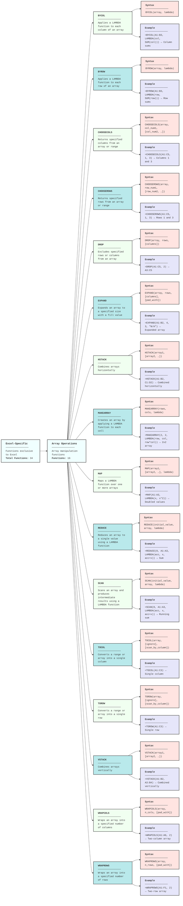

# Spreadsheets-Functions-Arrays

```mermaid

graph LR
    ExcelSpec["<div align='left' style='font-family: MonoLisa, monospace;'><b style='font-size: 1.1em;'>Excel-Specific</b><br/>────────────────<br/>Functions exclusive to Excel<br/><b>Total Functions:</b> 34</div>"]
    
    ExcelSpec --> ArrayOps["<div align='left' style='font-family: MonoLisa, monospace;'><b style='font-size: 1.1em;'>Array Operations</b><br/>────────────────<br/>Array manipulation functions<br/><b>Functions:</b> 16</div>"]
    
    %% Array Operations (16 functions)
    %% BYCOL - Function 1
    ArrayOps --> BYCOL["<div align='left' style='font-family: MonoLisa, monospace;'><b>BYCOL</b><br/>────────────────<br/>Applies a LAMBDA function to each column of an array</div>"]
    BYCOL --> BYCOLSYNTAX["<div align='left' style='font-family: MonoLisa, monospace;'><b>Syntax</b><br/>────────────────<br/>BYCOL(array, lambda)</div>"]
    BYCOL --> BYCOLEXAMPLE["<div align='left' style='font-family: MonoLisa, monospace;'><b>Example</b><br/>────────────────<br/>=BYCOL(A1:B3, LAMBDA(col, SUM(col))) → Column sums</div>"]
    
    %% BYROW - Function 2
    ArrayOps --> BYROW["<div align='left' style='font-family: MonoLisa, monospace;'><b>BYROW</b><br/>────────────────<br/>Applies a LAMBDA function to each row of an array</div>"]
    BYROW --> BYROWSYNTAX["<div align='left' style='font-family: MonoLisa, monospace;'><b>Syntax</b><br/>────────────────<br/>BYROW(array, lambda)</div>"]
    BYROW --> BYROWEXAMPLE["<div align='left' style='font-family: MonoLisa, monospace;'><b>Example</b><br/>────────────────<br/>=BYROW(A1:B3, LAMBDA(row, SUM(row))) → Row sums</div>"]
    
    %% CHOOSECOLS - Function 3
    ArrayOps --> CHOOSECOLS["<div align='left' style='font-family: MonoLisa, monospace;'><b>CHOOSECOLS</b><br/>────────────────<br/>Returns specified columns from an array or range</div>"]
    CHOOSECOLS --> CHOOSECOLSSYNTAX["<div align='left' style='font-family: MonoLisa, monospace;'><b>Syntax</b><br/>────────────────<br/>CHOOSECOLS(array, col_num1, [col_num2, …])</div>"]
    CHOOSECOLS --> CHOOSECOLSEXAMPLE["<div align='left' style='font-family: MonoLisa, monospace;'><b>Example</b><br/>────────────────<br/>=CHOOSECOLS(A1:C5, 1, 3) → Columns 1 and 3</div>"]
    
    %% CHOOSEROWS - Function 4
    ArrayOps --> CHOOSEROWS["<div align='left' style='font-family: MonoLisa, monospace;'><b>CHOOSEROWS</b><br/>────────────────<br/>Returns specified rows from an array or range</div>"]
    CHOOSEROWS --> CHOOSEROWSSYNTAX["<div align='left' style='font-family: MonoLisa, monospace;'><b>Syntax</b><br/>────────────────<br/>CHOOSEROWS(array, row_num1, [row_num2, …])</div>"]
    CHOOSEROWS --> CHOOSEROWSEXAMPLE["<div align='left' style='font-family: MonoLisa, monospace;'><b>Example</b><br/>────────────────<br/>=CHOOSEROWS(A1:C5, 1, 3) → Rows 1 and 3</div>"]
    
    %% DROP - Function 5
    ArrayOps --> DROP["<div align='left' style='font-family: MonoLisa, monospace;'><b>DROP</b><br/>────────────────<br/>Excludes specified rows or columns from an array</div>"]
    DROP --> DROPSYNTAX["<div align='left' style='font-family: MonoLisa, monospace;'><b>Syntax</b><br/>────────────────<br/>DROP(array, rows, [columns])</div>"]
    DROP --> DROPEXAMPLE["<div align='left' style='font-family: MonoLisa, monospace;'><b>Example</b><br/>────────────────<br/>=DROP(A1:C5, 2) → A3:C5</div>"]
    
    %% EXPAND - Function 6
    ArrayOps --> EXPAND["<div align='left' style='font-family: MonoLisa, monospace;'><b>EXPAND</b><br/>────────────────<br/>Expands an array to a specified size with a fill value</div>"]
    EXPAND --> EXPANDSYNTAX["<div align='left' style='font-family: MonoLisa, monospace;'><b>Syntax</b><br/>────────────────<br/>EXPAND(array, rows, [columns], [pad_with])</div>"]
    EXPAND --> EXPANDEXAMPLE["<div align='left' style='font-family: MonoLisa, monospace;'><b>Example</b><br/>────────────────<br/>=EXPAND(A1:B2, 4, 3, &quot;N/A&quot;) → Expanded array</div>"]
    
    %% HSTACK - Function 7
    ArrayOps --> HSTACK["<div align='left' style='font-family: MonoLisa, monospace;'><b>HSTACK</b><br/>────────────────<br/>Combines arrays horizontally</div>"]
    HSTACK --> HSTACKSYNTAX["<div align='left' style='font-family: MonoLisa, monospace;'><b>Syntax</b><br/>────────────────<br/>HSTACK(array1, [array2, …])</div>"]
    HSTACK --> HSTACKEXAMPLE["<div align='left' style='font-family: MonoLisa, monospace;'><b>Example</b><br/>────────────────<br/>=HSTACK(A1:B2, C1:D2) → Combined horizontally</div>"]
    
    %% MAKEARRAY - Function 8
    ArrayOps --> MAKEARRAY["<div align='left' style='font-family: MonoLisa, monospace;'><b>MAKEARRAY</b><br/>────────────────<br/>Creates an array by applying a LAMBDA function to each cell</div>"]
    MAKEARRAY --> MAKEARRAYSYNTAX["<div align='left' style='font-family: MonoLisa, monospace;'><b>Syntax</b><br/>────────────────<br/>MAKEARRAY(rows, cols, lambda)</div>"]
    MAKEARRAY --> MAKEARRAYEXAMPLE["<div align='left' style='font-family: MonoLisa, monospace;'><b>Example</b><br/>────────────────<br/>=MAKEARRAY(2, 2, LAMBDA(row, col, row*col)) → 2x2 array</div>"]
    
    %% MAP - Function 9
    ArrayOps --> MAP["<div align='left' style='font-family: MonoLisa, monospace;'><b>MAP</b><br/>────────────────<br/>Maps a LAMBDA function over one or more arrays</div>"]
    MAP --> MAPSYNTAX["<div align='left' style='font-family: MonoLisa, monospace;'><b>Syntax</b><br/>────────────────<br/>MAP(array1, [array2, …], lambda)</div>"]
    MAP --> MAPEXAMPLE["<div align='left' style='font-family: MonoLisa, monospace;'><b>Example</b><br/>────────────────<br/>=MAP(A1:A3, LAMBDA(x, x*2)) → Doubled values</div>"]
    
    %% REDUCE - Function 10
    ArrayOps --> REDUCE["<div align='left' style='font-family: MonoLisa, monospace;'><b>REDUCE</b><br/>────────────────<br/>Reduces an array to a single value using a LAMBDA function</div>"]
    REDUCE --> REDUCESYNTAX["<div align='left' style='font-family: MonoLisa, monospace;'><b>Syntax</b><br/>────────────────<br/>REDUCE(initial_value, array, lambda)</div>"]
    REDUCE --> REDUCEEXAMPLE["<div align='left' style='font-family: MonoLisa, monospace;'><b>Example</b><br/>────────────────<br/>=REDUCE(0, A1:A3, LAMBDA(acc, x, acc+x)) → Sum</div>"]
    
    %% SCAN - Function 11
    ArrayOps --> SCAN["<div align='left' style='font-family: MonoLisa, monospace;'><b>SCAN</b><br/>────────────────<br/>Scans an array and produces intermediate results using a LAMBDA function</div>"]
    SCAN --> SCANSYNTAX["<div align='left' style='font-family: MonoLisa, monospace;'><b>Syntax</b><br/>────────────────<br/>SCAN(initial_value, array, lambda)</div>"]
    SCAN --> SCANEXAMPLE["<div align='left' style='font-family: MonoLisa, monospace;'><b>Example</b><br/>────────────────<br/>=SCAN(0, A1:A3, LAMBDA(acc, x, acc+x)) → Running sum</div>"]
    
    %% TOCOL - Function 12
    ArrayOps --> TOCOL["<div align='left' style='font-family: MonoLisa, monospace;'><b>TOCOL</b><br/>────────────────<br/>Converts a range or array into a single column</div>"]
    TOCOL --> TOCOLSYNTAX["<div align='left' style='font-family: MonoLisa, monospace;'><b>Syntax</b><br/>────────────────<br/>TOCOL(array, [ignore], [scan_by_column])</div>"]
    TOCOL --> TOCOLEXAMPLE["<div align='left' style='font-family: MonoLisa, monospace;'><b>Example</b><br/>────────────────<br/>=TOCOL(A1:C3) → Single column</div>"]
    
    %% TOROW - Function 13
    ArrayOps --> TOROW["<div align='left' style='font-family: MonoLisa, monospace;'><b>TOROW</b><br/>────────────────<br/>Converts a range or array into a single row</div>"]
    TOROW --> TOROWSYNTAX["<div align='left' style='font-family: MonoLisa, monospace;'><b>Syntax</b><br/>────────────────<br/>TOROW(array, [ignore], [scan_by_column])</div>"]
    TOROW --> TOROWEXAMPLE["<div align='left' style='font-family: MonoLisa, monospace;'><b>Example</b><br/>────────────────<br/>=TOROW(A1:C3) → Single row</div>"]
    
    %% VSTACK - Function 14
    ArrayOps --> VSTACK["<div align='left' style='font-family: MonoLisa, monospace;'><b>VSTACK</b><br/>────────────────<br/>Combines arrays vertically</div>"]
    VSTACK --> VSTACKSYNTAX["<div align='left' style='font-family: MonoLisa, monospace;'><b>Syntax</b><br/>────────────────<br/>VSTACK(array1, [array2, …])</div>"]
    VSTACK --> VSTACKEXAMPLE["<div align='left' style='font-family: MonoLisa, monospace;'><b>Example</b><br/>────────────────<br/>=VSTACK(A1:B2, A3:B4) → Combined vertically</div>"]
    
    %% WRAPCOLS - Function 15
    ArrayOps --> WRAPCOLS["<div align='left' style='font-family: MonoLisa, monospace;'><b>WRAPCOLS</b><br/>────────────────<br/>Wraps an array into a specified number of columns</div>"]
    WRAPCOLS --> WRAPCOLSSYNTAX["<div align='left' style='font-family: MonoLisa, monospace;'><b>Syntax</b><br/>────────────────<br/>WRAPCOLS(array, n_cols, [pad_with])</div>"]
    WRAPCOLS --> WRAPCOLSEXAMPLE["<div align='left' style='font-family: MonoLisa, monospace;'><b>Example</b><br/>────────────────<br/>=WRAPCOLS(A1:A6, 2) → Two-column array</div>"]
    
    %% WRAPROWS - Function 16
    ArrayOps --> WRAPROWS["<div align='left' style='font-family: MonoLisa, monospace;'><b>WRAPROWS</b><br/>────────────────<br/>Wraps an array into a specified number of rows</div>"]
    WRAPROWS --> WRAPROWSSYNTAX["<div align='left' style='font-family: MonoLisa, monospace;'><b>Syntax</b><br/>────────────────<br/>WRAPROWS(array, n_rows, [pad_with])</div>"]
    WRAPROWS --> WRAPROWSEXAMPLE["<div align='left' style='font-family: MonoLisa, monospace;'><b>Example</b><br/>────────────────<br/>=WRAPROWS(A1:F1, 2) → Two-row array</div>"]
    
    %% Styling
    style ExcelSpec fill:#F0FFFF,stroke:#333,stroke-width:2px
    style ArrayOps fill:#F0FFFF,stroke:#333,stroke-width:2px
    %% Functions alternate colors
    style BYCOL fill:#F0FFF0,stroke:#333,stroke-width:2px
    style BYROW fill:#B9E9EB,stroke:#333,stroke-width:2px
    style CHOOSECOLS fill:#F0FFF0,stroke:#333,stroke-width:2px
    style CHOOSEROWS fill:#B9E9EB,stroke:#333,stroke-width:2px
    style DROP fill:#F0FFF0,stroke:#333,stroke-width:2px
    style EXPAND fill:#B9E9EB,stroke:#333,stroke-width:2px
    style HSTACK fill:#F0FFF0,stroke:#333,stroke-width:2px
    style MAKEARRAY fill:#B9E9EB,stroke:#333,stroke-width:2px
    style MAP fill:#F0FFF0,stroke:#333,stroke-width:2px
    style REDUCE fill:#B9E9EB,stroke:#333,stroke-width:2px
    style SCAN fill:#F0FFF0,stroke:#333,stroke-width:2px
    style TOCOL fill:#B9E9EB,stroke:#333,stroke-width:2px
    style TOROW fill:#F0FFF0,stroke:#333,stroke-width:2px
    style VSTACK fill:#B9E9EB,stroke:#333,stroke-width:2px
    style WRAPCOLS fill:#F0FFF0,stroke:#333,stroke-width:2px
    style WRAPROWS fill:#B9E9EB,stroke:#333,stroke-width:2px
    %% All syntax nodes - pink
    style BYCOLSYNTAX fill:#FFE4E1,stroke:#333,stroke-width:2px
    style BYROWSYNTAX fill:#FFE4E1,stroke:#333,stroke-width:2px
    style CHOOSECOLSSYNTAX fill:#FFE4E1,stroke:#333,stroke-width:2px
    style CHOOSEROWSSYNTAX fill:#FFE4E1,stroke:#333,stroke-width:2px
    style DROPSYNTAX fill:#FFE4E1,stroke:#333,stroke-width:2px
    style EXPANDSYNTAX fill:#FFE4E1,stroke:#333,stroke-width:2px
    style HSTACKSYNTAX fill:#FFE4E1,stroke:#333,stroke-width:2px
    style MAKEARRAYSYNTAX fill:#FFE4E1,stroke:#333,stroke-width:2px
    style MAPSYNTAX fill:#FFE4E1,stroke:#333,stroke-width:2px
    style REDUCESYNTAX fill:#FFE4E1,stroke:#333,stroke-width:2px
    style SCANSYNTAX fill:#FFE4E1,stroke:#333,stroke-width:2px
    style TOCOLSYNTAX fill:#FFE4E1,stroke:#333,stroke-width:2px
    style TOROWSYNTAX fill:#FFE4E1,stroke:#333,stroke-width:2px
    style VSTACKSYNTAX fill:#FFE4E1,stroke:#333,stroke-width:2px
    style WRAPCOLSSYNTAX fill:#FFE4E1,stroke:#333,stroke-width:2px
    style WRAPROWSSYNTAX fill:#FFE4E1,stroke:#333,stroke-width:2px
    %% All example nodes - lavender
    style BYCOLEXAMPLE fill:#E6E6FA,stroke:#333,stroke-width:2px
    style BYROWEXAMPLE fill:#E6E6FA,stroke:#333,stroke-width:2px
    style CHOOSECOLSEXAMPLE fill:#E6E6FA,stroke:#333,stroke-width:2px
    style CHOOSEROWSEXAMPLE fill:#E6E6FA,stroke:#333,stroke-width:2px
    style DROPEXAMPLE fill:#E6E6FA,stroke:#333,stroke-width:2px
    style EXPANDEXAMPLE fill:#E6E6FA,stroke:#333,stroke-width:2px
    style HSTACKEXAMPLE fill:#E6E6FA,stroke:#333,stroke-width:2px
    style MAKEARRAYEXAMPLE fill:#E6E6FA,stroke:#333,stroke-width:2px
    style MAPEXAMPLE fill:#E6E6FA,stroke:#333,stroke-width:2px
    style REDUCEEXAMPLE fill:#E6E6FA,stroke:#333,stroke-width:2px
    style SCANEXAMPLE fill:#E6E6FA,stroke:#333,stroke-width:2px
    style TOCOLEXAMPLE fill:#E6E6FA,stroke:#333,stroke-width:2px
    style TOROWEXAMPLE fill:#E6E6FA,stroke:#333,stroke-width:2px
    style VSTACKEXAMPLE fill:#E6E6FA,stroke:#333,stroke-width:2px
    style WRAPCOLSEXAMPLE fill:#E6E6FA,stroke:#333,stroke-width:2px
    style WRAPROWSEXAMPLE fill:#E6E6FA,stroke:#333,stroke-width:2px
    
    
```