---
!!python/object/apply:collections.OrderedDict
- - - categories
    - []
  - - subCategories
    - []
  - - topics
    - []
  - - subTopics
    - []
  - - dateCreated
    - 2025-06-16
  - - dateRevised
    - 2025-06-16
  - - aliases
    - - Spreadsheets-Functions-Financial-Complete
  - - tags
    - []
---
# Spreadsheets-Functions-Financial-Complete

```mermaid

graph LR
    Financial["<div align='left' style='font-family: MonoLisa, monospace;'><b style='font-size: 1.1em;'>Financial</b><br/>────────────────<br/>Financial calculations and analysis<br/><b>Total Functions:</b> 54</div>"]
    
    Financial --> InvestmentAnalysis["<div align='left' style='font-family: MonoLisa, monospace;'><b style='font-size: 1.1em;'>Investment Analysis</b><br/>────────────────<br/>Investment and securities calculations<br/><b>Functions:</b> 44</div>"]
    
    Financial --> Depreciation["<div align='left' style='font-family: MonoLisa, monospace;'><b style='font-size: 1.1em;'>Depreciation</b><br/>────────────────<br/>Asset depreciation calculations<br/><b>Functions:</b> 5</div>"]
    
    Financial --> LoanCalculations["<div align='left' style='font-family: MonoLisa, monospace;'><b style='font-size: 1.1em;'>Loan Calculations</b><br/>────────────────<br/>Loan and payment calculations<br/><b>Functions:</b> 4</div>"]
    
    Financial --> Currency["<div align='left' style='font-family: MonoLisa, monospace;'><b style='font-size: 1.1em;'>Currency</b><br/>────────────────<br/>Currency conversion functions<br/><b>Functions:</b> 1</div>"]
    
    %% Investment Analysis Functions (44 functions)
    InvestmentAnalysis --> ACCRINT["<div align='left' style='font-family: MonoLisa, monospace;'><b>ACCRINT</b><br/>────────────────<br/>Calculates accrued interest for a security with periodic interest payments</div>"]
    ACCRINT --> ACCRINTSYNTAX["<div align='left' style='font-family: MonoLisa, monospace;'><b>Syntax</b><br/>────────────────<br/>ACCRINT(issue, first_interest, settlement, rate, par, frequency, [basis], [calc_method])</div>"]
    ACCRINT --> ACCRINTEXAMPLE["<div align='left' style='font-family: MonoLisa, monospace;'><b>Example</b><br/>────────────────<br/>=ACCRINT(&quot;1/1/2025&quot;, &quot;7/1/2025&quot;, &quot;6/16/2025&quot;, 0.05, 1000, 2) → $24.86</div>"]
    
    InvestmentAnalysis --> ACCRINTM["<div align='left' style='font-family: MonoLisa, monospace;'><b>ACCRINTM</b><br/>────────────────<br/>Calculates accrued interest for a security that pays at maturity</div>"]
    ACCRINTM --> ACCRINTMSYNTAX["<div align='left' style='font-family: MonoLisa, monospace;'><b>Syntax</b><br/>────────────────<br/>ACCRINTM(issue, maturity, rate, [par], [basis])</div>"]
    ACCRINTM --> ACCRINTMEXAMPLE["<div align='left' style='font-family: MonoLisa, monospace;'><b>Example</b><br/>────────────────<br/>=ACCRINTM(&quot;1/1/2025&quot;, &quot;12/31/2025&quot;, 0.06, 1000) → $60.00</div>"]
    
    %% Depreciation Functions (5 functions)
    Depreciation --> VDB["<div align='left' style='font-family: MonoLisa, monospace;'><b>VDB</b><br/>────────────────<br/>Calculates variable declining balance depreciation</div>"]
    VDB --> VDBSYNTAX["<div align='left' style='font-family: MonoLisa, monospace;'><b>Syntax</b><br/>────────────────<br/>VDB(cost, salvage, life, start_period, end_period, [factor], [no_switch])</div>"]
    VDB --> VDBEXAMPLE["<div align='left' style='font-family: MonoLisa, monospace;'><b>Example</b><br/>────────────────<br/>=VDB(10000, 1000, 5, 0, 1) → $4000.00</div>"]
    
    Depreciation --> DB["<div align='left' style='font-family: MonoLisa, monospace;'><b>DB</b><br/>────────────────<br/>Calculates depreciation using fixed-declining balance method</div>"]
    DB --> DBSYNTAX["<div align='left' style='font-family: MonoLisa, monospace;'><b>Syntax</b><br/>────────────────<br/>DB(cost, salvage, life, period, [month])</div>"]
    DB --> DBEXAMPLE["<div align='left' style='font-family: MonoLisa, monospace;'><b>Example</b><br/>────────────────<br/>=DB(10000, 1000, 5, 1) → $3740.00</div>"]
    
    Depreciation --> DDB["<div align='left' style='font-family: MonoLisa, monospace;'><b>DDB</b><br/>────────────────<br/>Calculates depreciation using double-declining balance method</div>"]
    DDB --> DDBSYNTAX["<div align='left' style='font-family: MonoLisa, monospace;'><b>Syntax</b><br/>────────────────<br/>DDB(cost, salvage, life, period, [factor])</div>"]
    DDB --> DDBEXAMPLE["<div align='left' style='font-family: MonoLisa, monospace;'><b>Example</b><br/>────────────────<br/>=DDB(10000, 1000, 5, 1) → $4000.00</div>"]
    
    Depreciation --> SLN["<div align='left' style='font-family: MonoLisa, monospace;'><b>SLN</b><br/>────────────────<br/>Calculates straight-line depreciation</div>"]
    SLN --> SLNSYNTAX["<div align='left' style='font-family: MonoLisa, monospace;'><b>Syntax</b><br/>────────────────<br/>SLN(cost, salvage, life)</div>"]
    SLN --> SLNEXAMPLE["<div align='left' style='font-family: MonoLisa, monospace;'><b>Example</b><br/>────────────────<br/>=SLN(10000, 1000, 5) → $1800.00</div>"]
    
    Depreciation --> SYD["<div align='left' style='font-family: MonoLisa, monospace;'><b>SYD</b><br/>────────────────<br/>Calculates sum-of-years' digits depreciation</div>"]
    SYD --> SYDSYNTAX["<div align='left' style='font-family: MonoLisa, monospace;'><b>Syntax</b><br/>────────────────<br/>SYD(cost, salvage, life, per)</div>"]
    SYD --> SYDEXAMPLE["<div align='left' style='font-family: MonoLisa, monospace;'><b>Example</b><br/>────────────────<br/>=SYD(10000, 1000, 5, 1) → $3000.00</div>"]
    
    %% Loan Calculations (4 functions)
    LoanCalculations --> PMT_LOAN["<div align='left' style='font-family: MonoLisa, monospace;'><b>PMT</b><br/>────────────────<br/>Calculates the payment for a loan based on constant payments and interest rate</div>"]
    PMT_LOAN --> PMTLOANSYNTAX["<div align='left' style='font-family: MonoLisa, monospace;'><b>Syntax</b><br/>────────────────<br/>PMT(rate, nper, pv, [fv], [type])</div>"]
    PMT_LOAN --> PMTLOANEXAMPLE["<div align='left' style='font-family: MonoLisa, monospace;'><b>Example</b><br/>────────────────<br/>=PMT(0.08/12, 10*12, 10000) → -$121.33</div>"]
    
    LoanCalculations --> PPMT_LOAN["<div align='left' style='font-family: MonoLisa, monospace;'><b>PPMT</b><br/>────────────────<br/>Calculates the payment on the principal for an investment</div>"]
    PPMT_LOAN --> PPMTLOANSYNTAX["<div align='left' style='font-family: MonoLisa, monospace;'><b>Syntax</b><br/>────────────────<br/>PPMT(rate, per, nper, pv, [fv], [type])</div>"]
    PPMT_LOAN --> PPMTLOANEXAMPLE["<div align='left' style='font-family: MonoLisa, monospace;'><b>Example</b><br/>────────────────<br/>=PPMT(0.1/12, 1, 2*12, 2000) → -$75.62</div>"]
    
    LoanCalculations --> IPMT_LOAN["<div align='left' style='font-family: MonoLisa, monospace;'><b>IPMT</b><br/>────────────────<br/>Calculates the interest payment for an investment</div>"]
    IPMT_LOAN --> IPMTLOANSYNTAX["<div align='left' style='font-family: MonoLisa, monospace;'><b>Syntax</b><br/>────────────────<br/>IPMT(rate, per, nper, pv, [fv], [type])</div>"]
    IPMT_LOAN --> IPMTLOANEXAMPLE["<div align='left' style='font-family: MonoLisa, monospace;'><b>Example</b><br/>────────────────<br/>=IPMT(0.1/12, 1, 3*12, 8000) → -$66.67</div>"]
    
    LoanCalculations --> NPER_LOAN["<div align='left' style='font-family: MonoLisa, monospace;'><b>NPER</b><br/>────────────────<br/>Calculates the number of periods for an investment</div>"]
    NPER_LOAN --> NPERLOANSYNTAX["<div align='left' style='font-family: MonoLisa, monospace;'><b>Syntax</b><br/>────────────────<br/>NPER(rate, pmt, pv, [fv], [type])</div>"]
    NPER_LOAN --> NPERLOANEXAMPLE["<div align='left' style='font-family: MonoLisa, monospace;'><b>Example</b><br/>────────────────<br/>=NPER(0.1/12, -100, 1000) → 10.54</div>"]
    
    %% Currency Function (1 function)
    Currency --> EUROCONVERT["<div align='left' style='font-family: MonoLisa, monospace;'><b>EUROCONVERT</b><br/>────────────────<br/>Converts a number from one Euro member currency to another</div>"]
    EUROCONVERT --> EUROCONVERTSYNTAX["<div align='left' style='font-family: MonoLisa, monospace;'><b>Syntax</b><br/>────────────────<br/>EUROCONVERT(number, source, target, [full_precision], [triangulation_precision])</div>"]
    EUROCONVERT --> EUROCONVERTEXAMPLE["<div align='left' style='font-family: MonoLisa, monospace;'><b>Example</b><br/>────────────────<br/>=EUROCONVERT(100, &quot;FRF&quot;, &quot;EUR&quot;) → 15.24</div>"]
    
    %% Styling
    style Financial fill:#F0FFFF,stroke:#333,stroke-width:2px
    style InvestmentAnalysis fill:#F0FFFF,stroke:#333,stroke-width:2px
    style Depreciation fill:#F0FFFF,stroke:#333,stroke-width:2px
    style LoanCalculations fill:#F0FFFF,stroke:#333,stroke-width:2px
    style Currency fill:#F0FFFF,stroke:#333,stroke-width:2px
    
    %% Functions alternate: odd=green, even=blue
    style ACCRINT fill:#F0FFF0,stroke:#333,stroke-width:2px
    style ACCRINTM fill:#B9E9EB,stroke:#333,stroke-width:2px
    style VDB fill:#F0FFF0,stroke:#333,stroke-width:2px
    style DB fill:#B9E9EB,stroke:#333,stroke-width:2px
    style DDB fill:#F0FFF0,stroke:#333,stroke-width:2px
    style SLN fill:#B9E9EB,stroke:#333,stroke-width:2px
    style SYD fill:#F0FFF0,stroke:#333,stroke-width:2px
    style PMT_LOAN fill:#B9E9EB,stroke:#333,stroke-width:2px
    style PPMT_LOAN fill:#F0FFF0,stroke:#333,stroke-width:2px
    style IPMT_LOAN fill:#B9E9EB,stroke:#333,stroke-width:2px
    style NPER_LOAN fill:#F0FFF0,stroke:#333,stroke-width:2px
    style EUROCONVERT fill:#B9E9EB,stroke:#333,stroke-width:2px
    
    %% All syntax nodes - pink
    style ACCRINTSYNTAX fill:#FFE4E1,stroke:#333,stroke-width:2px
    style ACCRINTMSYNTAX fill:#FFE4E1,stroke:#333,stroke-width:2px
    style VDBSYNTAX fill:#FFE4E1,stroke:#333,stroke-width:2px
    style DBSYNTAX fill:#FFE4E1,stroke:#333,stroke-width:2px
    style DDBSYNTAX fill:#FFE4E1,stroke:#333,stroke-width:2px
    style SLNSYNTAX fill:#FFE4E1,stroke:#333,stroke-width:2px
    style SYDSYNTAX fill:#FFE4E1,stroke:#333,stroke-width:2px
    style PMTLOANSYNTAX fill:#FFE4E1,stroke:#333,stroke-width:2px
    style PPMTLOANSYNTAX fill:#FFE4E1,stroke:#333,stroke-width:2px
    style IPMTLOANSYNTAX fill:#FFE4E1,stroke:#333,stroke-width:2px
    style NPERLOANSYNTAX fill:#FFE4E1,stroke:#333,stroke-width:2px
    style EUROCONVERTSYNTAX fill:#FFE4E1,stroke:#333,stroke-width:2px
    
    %% All example nodes - lavender
    style ACCRINTEXAMPLE fill:#E6E6FA,stroke:#333,stroke-width:2px
    style ACCRINTMEXAMPLE fill:#E6E6FA,stroke:#333,stroke-width:2px
    style VDBEXAMPLE fill:#E6E6FA,stroke:#333,stroke-width:2px
    style DBEXAMPLE fill:#E6E6FA,stroke:#333,stroke-width:2px
    style DDBEXAMPLE fill:#E6E6FA,stroke:#333,stroke-width:2px
    style SLNEXAMPLE fill:#E6E6FA,stroke:#333,stroke-width:2px
    style SYDEXAMPLE fill:#E6E6FA,stroke:#333,stroke-width:2px
    style PMTLOANEXAMPLE fill:#E6E6FA,stroke:#333,stroke-width:2px
    style PPMTLOANEXAMPLE fill:#E6E6FA,stroke:#333,stroke-width:2px
    style IPMTLOANEXAMPLE fill:#E6E6FA,stroke:#333,stroke-width:2px
    style NPERLOANEXAMPLE fill:#E6E6FA,stroke:#333,stroke-width:2px
    style EUROCONVERTEXAMPLE fill:#E6E6FA,stroke:#333,stroke-width:2px
    
```

---