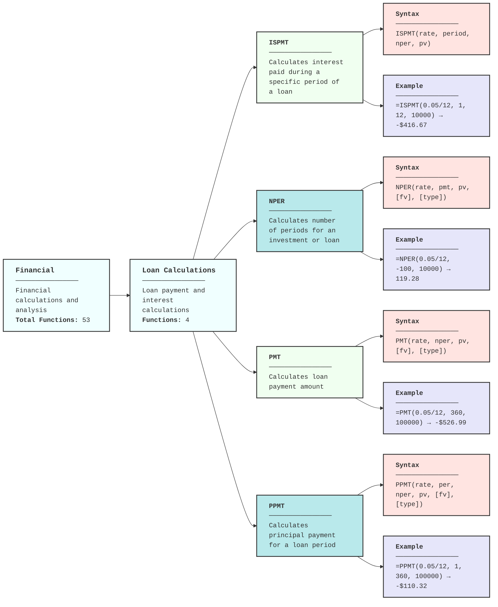

---
!!python/object/apply:collections.OrderedDict
- - - categories
    - []
  - - subCategories
    - []
  - - topics
    - []
  - - subTopics
    - []
  - - dateCreated
    - 2025-06-16
  - - dateRevised
    - 2025-06-16
  - - aliases
    - - Spreadsheets-Functions-Financial-Loans
  - - tags
    - []
---
# Spreadsheets-Functions-Financial-Loans

