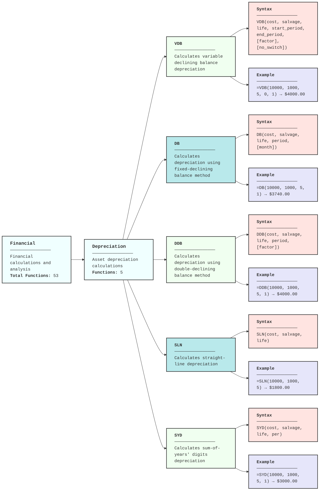

# Spreadsheets-Functions-Financial

```mermaid

graph LR
    Financial["<div align='left' style='font-family: MonoLisa, monospace;'><b style='font-size: 1.1em;'>Financial</b><br/>────────────────<br/>Financial calculations and analysis<br/><b>Total Functions:</b> 53</div>"]
    
    Financial --> Depreciation["<div align='left' style='font-family: MonoLisa, monospace;'><b style='font-size: 1.1em;'>Depreciation</b><br/>────────────────<br/>Asset depreciation calculations<br/><b>Functions:</b> 5</div>"]
    
    %% Depreciation (5 functions)
    %% VDB - Function 1
    Depreciation --> VDB["<div align='left' style='font-family: MonoLisa, monospace;'><b>VDB</b><br/>────────────────<br/>Calculates variable declining balance depreciation</div>"]
    VDB --> VDBSYNTAX["<div align='left' style='font-family: MonoLisa, monospace;'><b>Syntax</b><br/>────────────────<br/>VDB(cost, salvage, life, start_period, end_period, [factor], [no_switch])</div>"]
    VDB --> VDBEXAMPLE["<div align='left' style='font-family: MonoLisa, monospace;'><b>Example</b><br/>────────────────<br/>=VDB(10000, 1000, 5, 0, 1) → $4000.00</div>"]
    
    %% DB - Function 2
    Depreciation --> DB["<div align='left' style='font-family: MonoLisa, monospace;'><b>DB</b><br/>────────────────<br/>Calculates depreciation using fixed-declining balance method</div>"]
    DB --> DBSYNTAX["<div align='left' style='font-family: MonoLisa, monospace;'><b>Syntax</b><br/>────────────────<br/>DB(cost, salvage, life, period, [month])</div>"]
    DB --> DBEXAMPLE["<div align='left' style='font-family: MonoLisa, monospace;'><b>Example</b><br/>────────────────<br/>=DB(10000, 1000, 5, 1) → $3740.00</div>"]
    
    %% DDB - Function 3
    Depreciation --> DDB["<div align='left' style='font-family: MonoLisa, monospace;'><b>DDB</b><br/>────────────────<br/>Calculates depreciation using double-declining balance method</div>"]
    DDB --> DDBSYNTAX["<div align='left' style='font-family: MonoLisa, monospace;'><b>Syntax</b><br/>────────────────<br/>DDB(cost, salvage, life, period, [factor])</div>"]
    DDB --> DDBEXAMPLE["<div align='left' style='font-family: MonoLisa, monospace;'><b>Example</b><br/>────────────────<br/>=DDB(10000, 1000, 5, 1) → $4000.00</div>"]
    
    %% SLN - Function 4
    Depreciation --> SLN["<div align='left' style='font-family: MonoLisa, monospace;'><b>SLN</b><br/>────────────────<br/>Calculates straight-line depreciation</div>"]
    SLN --> SLNSYNTAX["<div align='left' style='font-family: MonoLisa, monospace;'><b>Syntax</b><br/>────────────────<br/>SLN(cost, salvage, life)</div>"]
    SLN --> SLNEXAMPLE["<div align='left' style='font-family: MonoLisa, monospace;'><b>Example</b><br/>────────────────<br/>=SLN(10000, 1000, 5) → $1800.00</div>"]
    
    %% SYD - Function 5
    Depreciation --> SYD["<div align='left' style='font-family: MonoLisa, monospace;'><b>SYD</b><br/>────────────────<br/>Calculates sum-of-years' digits depreciation</div>"]
    SYD --> SYDSYNTAX["<div align='left' style='font-family: MonoLisa, monospace;'><b>Syntax</b><br/>────────────────<br/>SYD(cost, salvage, life, per)</div>"]
    SYD --> SYDEXAMPLE["<div align='left' style='font-family: MonoLisa, monospace;'><b>Example</b><br/>────────────────<br/>=SYD(10000, 1000, 5, 1) → $3000.00</div>"]
    
    %% Styling
    style Financial fill:#F0FFFF,stroke:#333,stroke-width:2px
    style Depreciation fill:#F0FFFF,stroke:#333,stroke-width:2px
    %% Functions alternate colors
    style VDB fill:#F0FFF0,stroke:#333,stroke-width:2px
    style DB fill:#B9E9EB,stroke:#333,stroke-width:2px
    style DDB fill:#F0FFF0,stroke:#333,stroke-width:2px
    style SLN fill:#B9E9EB,stroke:#333,stroke-width:2px
    style SYD fill:#F0FFF0,stroke:#333,stroke-width:2px
    %% All syntax nodes - pink
    style VDBSYNTAX fill:#FFE4E1,stroke:#333,stroke-width:2px
    style DBSYNTAX fill:#FFE4E1,stroke:#333,stroke-width:2px
    style DDBSYNTAX fill:#FFE4E1,stroke:#333,stroke-width:2px
    style SLNSYNTAX fill:#FFE4E1,stroke:#333,stroke-width:2px
    style SYDSYNTAX fill:#FFE4E1,stroke:#333,stroke-width:2px
    %% All example nodes - lavender
    style VDBEXAMPLE fill:#E6E6FA,stroke:#333,stroke-width:2px
    style DBEXAMPLE fill:#E6E6FA,stroke:#333,stroke-width:2px
    style DDBEXAMPLE fill:#E6E6FA,stroke:#333,stroke-width:2px
    style SLNEXAMPLE fill:#E6E6FA,stroke:#333,stroke-width:2px
    style SYDEXAMPLE fill:#E6E6FA,stroke:#333,stroke-width:2px
    
```