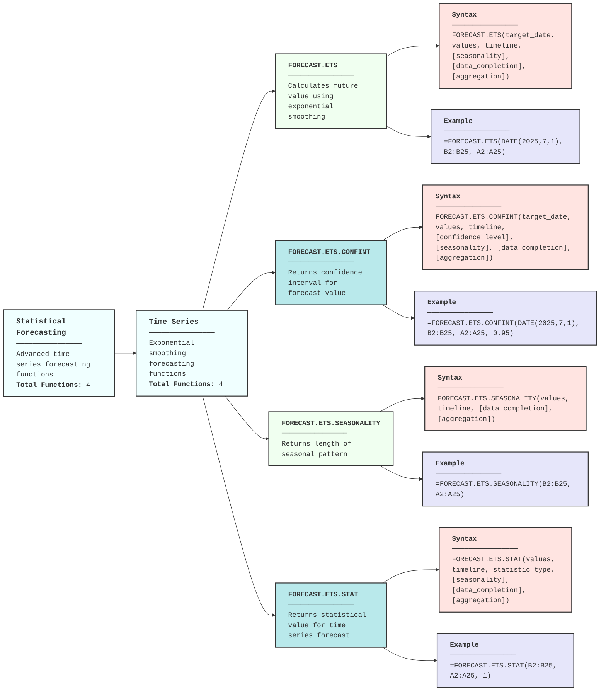

# Spreadsheets-Functions-Forecasting

```mermaid

graph LR
    A["<div align='left' style='font-family: MonoLisa, monospace;'><b style='font-size: 1.1em;'>Statistical Forecasting</b><br/>────────────────<br/>Advanced time series forecasting functions<br/><b>Total Functions:</b> 4</div>"] --> B["<div align='left' style='font-family: MonoLisa, monospace;'><b style='font-size: 1.1em;'>Time Series</b><br/>────────────────<br/>Exponential smoothing forecasting functions<br/><b>Total Functions:</b> 4</div>"]
    
    B --> FORECASTETS["<div align='left' style='font-family: MonoLisa, monospace;'><b>FORECAST.ETS</b><br/>────────────────<br/>Calculates future value using exponential smoothing</div>"]
    
    FORECASTETS --> FORECASTETSSYNTAX["<div align='left' style='font-family: MonoLisa, monospace;'><b>Syntax</b><br/>────────────────<br/>FORECAST.ETS(target_date, values, timeline, [seasonality], [data_completion], [aggregation])</div>"]
    
    FORECASTETS --> FORECASTETSEXAMPLE["<div align='left' style='font-family: MonoLisa, monospace;'><b>Example</b><br/>────────────────<br/>=FORECAST.ETS(DATE(2025,7,1), B2:B25, A2:A25)</div>"]
    
    B --> FORECASTETSCONFINT["<div align='left' style='font-family: MonoLisa, monospace;'><b>FORECAST.ETS.CONFINT</b><br/>────────────────<br/>Returns confidence interval for forecast value</div>"]
    
    FORECASTETSCONFINT --> FORECASTETSCONFINTSYNTAX["<div align='left' style='font-family: MonoLisa, monospace;'><b>Syntax</b><br/>────────────────<br/>FORECAST.ETS.CONFINT(target_date, values, timeline, [confidence_level], [seasonality], [data_completion], [aggregation])</div>"]
    
    FORECASTETSCONFINT --> FORECASTETSCONFINTEXAMPLE["<div align='left' style='font-family: MonoLisa, monospace;'><b>Example</b><br/>────────────────<br/>=FORECAST.ETS.CONFINT(DATE(2025,7,1), B2:B25, A2:A25, 0.95)</div>"]
    
    B --> FORECASTETSSEASONALITY["<div align='left' style='font-family: MonoLisa, monospace;'><b>FORECAST.ETS.SEASONALITY</b><br/>────────────────<br/>Returns length of seasonal pattern</div>"]
    
    FORECASTETSSEASONALITY --> FORECASTETSSEASONALITYSYNTAX["<div align='left' style='font-family: MonoLisa, monospace;'><b>Syntax</b><br/>────────────────<br/>FORECAST.ETS.SEASONALITY(values, timeline, [data_completion], [aggregation])</div>"]
    
    FORECASTETSSEASONALITY --> FORECASTETSSEASONALITYEXAMPLE["<div align='left' style='font-family: MonoLisa, monospace;'><b>Example</b><br/>────────────────<br/>=FORECAST.ETS.SEASONALITY(B2:B25, A2:A25)</div>"]
    
    B --> FORECASTETSSTAT["<div align='left' style='font-family: MonoLisa, monospace;'><b>FORECAST.ETS.STAT</b><br/>────────────────<br/>Returns statistical value for time series forecast</div>"]
    
    FORECASTETSSTAT --> FORECASTETSSTATSYNTAX["<div align='left' style='font-family: MonoLisa, monospace;'><b>Syntax</b><br/>────────────────<br/>FORECAST.ETS.STAT(values, timeline, statistic_type, [seasonality], [data_completion], [aggregation])</div>"]
    
    FORECASTETSSTAT --> FORECASTETSSTATEXAMPLE["<div align='left' style='font-family: MonoLisa, monospace;'><b>Example</b><br/>────────────────<br/>=FORECAST.ETS.STAT(B2:B25, A2:A25, 1)</div>"]
    
    style A fill:#F0FFFF,stroke:#333,stroke-width:2px
    style B fill:#F0FFFF,stroke:#333,stroke-width:2px
    style FORECASTETS fill:#F0FFF0,stroke:#333,stroke-width:2px
    style FORECASTETSSYNTAX fill:#FFE4E1,stroke:#333,stroke-width:2px
    style FORECASTETSEXAMPLE fill:#E6E6FA,stroke:#333,stroke-width:2px
    style FORECASTETSCONFINT fill:#B9E9EB,stroke:#333,stroke-width:2px
    style FORECASTETSCONFINTSYNTAX fill:#FFE4E1,stroke:#333,stroke-width:2px
    style FORECASTETSCONFINTEXAMPLE fill:#E6E6FA,stroke:#333,stroke-width:2px
    style FORECASTETSSEASONALITY fill:#F0FFF0,stroke:#333,stroke-width:2px
    style FORECASTETSSEASONALITYSYNTAX fill:#FFE4E1,stroke:#333,stroke-width:2px
    style FORECASTETSSEASONALITYEXAMPLE fill:#E6E6FA,stroke:#333,stroke-width:2px
    style FORECASTETSSTAT fill:#B9E9EB,stroke:#333,stroke-width:2px
    style FORECASTETSSTATSYNTAX fill:#FFE4E1,stroke:#333,stroke-width:2px
    style FORECASTETSSTATEXAMPLE fill:#E6E6FA,stroke:#333,stroke-width:2px
    
    
```
