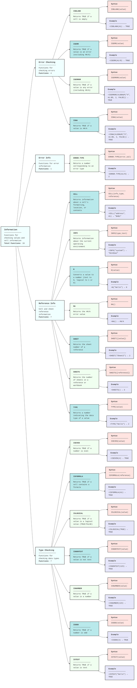

# Spreadsheets-Functions-Information

```mermaid

graph LR
    Information["<div align='left' style='font-family: MonoLisa, monospace;'><b style='font-size: 1.1em;'>Information</b><br/>────────────────<br/>Functions for checking values and cell information<br/><b>Total Functions:</b> 19</div>"]
    
    Information --> ErrorCheck["<div align='left' style='font-family: MonoLisa, monospace;'><b style='font-size: 1.1em;'>Error Checking</b><br/>────────────────<br/>Functions for checking errors<br/><b>Functions:</b> 4</div>"]
    Information --> ErrorInfo["<div align='left' style='font-family: MonoLisa, monospace;'><b style='font-size: 1.1em;'>Error Info</b><br/>────────────────<br/>Functions for error information<br/><b>Functions:</b> 1</div>"]
    Information --> RefInfo["<div align='left' style='font-family: MonoLisa, monospace;'><b style='font-size: 1.1em;'>Reference Info</b><br/>────────────────<br/>Cell and sheet reference information<br/><b>Functions:</b> 7</div>"]
    Information --> TypeCheck["<div align='left' style='font-family: MonoLisa, monospace;'><b style='font-size: 1.1em;'>Type Checking</b><br/>────────────────<br/>Functions for checking data types<br/><b>Functions:</b> 7</div>"]
    
    %% Error Checking (4 functions)
    %% ISBLANK - Function 1
    ErrorCheck --> ISBLANK["<div align='left' style='font-family: MonoLisa, monospace;'><b>ISBLANK</b><br/>────────────────<br/>Returns TRUE if a cell is empty</div>"]
    ISBLANK --> ISBLANKSYNTAX["<div align='left' style='font-family: MonoLisa, monospace;'><b>Syntax</b><br/>────────────────<br/>ISBLANK(value)</div>"]
    ISBLANK --> ISBLANKEXAMPLE["<div align='left' style='font-family: MonoLisa, monospace;'><b>Example</b><br/>────────────────<br/>=ISBLANK(A1) → TRUE</div>"]
    
    %% ISERR - Function 2
    ErrorCheck --> ISERR["<div align='left' style='font-family: MonoLisa, monospace;'><b>ISERR</b><br/>────────────────<br/>Returns TRUE if a value is an error (excluding #N/A)</div>"]
    ISERR --> ISERRSYNTAX["<div align='left' style='font-family: MonoLisa, monospace;'><b>Syntax</b><br/>────────────────<br/>ISERR(value)</div>"]
    ISERR --> ISERREXAMPLE["<div align='left' style='font-family: MonoLisa, monospace;'><b>Example</b><br/>────────────────<br/>=ISERR(A1/0) → TRUE</div>"]
    
    %% ISERROR - Function 3
    ErrorCheck --> ISERROR["<div align='left' style='font-family: MonoLisa, monospace;'><b>ISERROR</b><br/>────────────────<br/>Returns TRUE if a value is any error (including #N/A)</div>"]
    ISERROR --> ISERRORSYNTAX["<div align='left' style='font-family: MonoLisa, monospace;'><b>Syntax</b><br/>────────────────<br/>ISERROR(value)</div>"]
    ISERROR --> ISERROREXAMPLE["<div align='left' style='font-family: MonoLisa, monospace;'><b>Example</b><br/>────────────────<br/>=ISERROR(VLOOKUP(&quot;X&quot;, A1:B5, 2, FALSE)) → TRUE</div>"]
    
    %% ISNA - Function 4
    ErrorCheck --> ISNA["<div align='left' style='font-family: MonoLisa, monospace;'><b>ISNA</b><br/>────────────────<br/>Returns TRUE if a value is #N/A</div>"]
    ISNA --> ISNASYNTAX["<div align='left' style='font-family: MonoLisa, monospace;'><b>Syntax</b><br/>────────────────<br/>ISNA(value)</div>"]
    ISNA --> ISNAEXAMPLE["<div align='left' style='font-family: MonoLisa, monospace;'><b>Example</b><br/>────────────────<br/>=ISNA(VLOOKUP(&quot;X&quot;, A1:B5, 2, FALSE)) → TRUE</div>"]
    
    %% Error Info (1 function)
    %% ERROR.TYPE - Function 5
    ErrorInfo --> ERRORTYPE["<div align='left' style='font-family: MonoLisa, monospace;'><b>ERROR.TYPE</b><br/>────────────────<br/>Returns a number corresponding to an error type</div>"]
    ERRORTYPE --> ERRORTYPESYNTAX["<div align='left' style='font-family: MonoLisa, monospace;'><b>Syntax</b><br/>────────────────<br/>ERROR.TYPE(error_val)</div>"]
    ERRORTYPE --> ERRORTYPEEXAMPLE["<div align='left' style='font-family: MonoLisa, monospace;'><b>Example</b><br/>────────────────<br/>=ERROR.TYPE(A1/0) → 2</div>"]
    
    %% Reference Info (7 functions)
    %% CELL - Function 6
    RefInfo --> CELL["<div align='left' style='font-family: MonoLisa, monospace;'><b>CELL</b><br/>────────────────<br/>Returns information about a cell's formatting, location, or contents</div>"]
    CELL --> CELLSYNTAX["<div align='left' style='font-family: MonoLisa, monospace;'><b>Syntax</b><br/>────────────────<br/>CELL(info_type, reference)</div>"]
    CELL --> CELLEXAMPLE["<div align='left' style='font-family: MonoLisa, monospace;'><b>Example</b><br/>────────────────<br/>=CELL(&quot;address&quot;, A1) → &quot;$A$1&quot;</div>"]
    
    %% INFO - Function 7
    RefInfo --> INFO["<div align='left' style='font-family: MonoLisa, monospace;'><b>INFO</b><br/>────────────────<br/>Returns information about the current operating environment</div>"]
    INFO --> INFOSYNTAX["<div align='left' style='font-family: MonoLisa, monospace;'><b>Syntax</b><br/>────────────────<br/>INFO(type_text)</div>"]
    INFO --> INFOEXAMPLE["<div align='left' style='font-family: MonoLisa, monospace;'><b>Example</b><br/>────────────────<br/>=INFO(&quot;system&quot;) → &quot;Windows&quot;</div>"]
    
    %% N - Function 8
    RefInfo --> N["<div align='left' style='font-family: MonoLisa, monospace;'><b>N</b><br/>────────────────<br/>Converts a value to a number (text to 0, logical to 1 or 0)</div>"]
    N --> NSYNTAX["<div align='left' style='font-family: MonoLisa, monospace;'><b>Syntax</b><br/>────────────────<br/>N(value)</div>"]
    N --> NEXAMPLE["<div align='left' style='font-family: MonoLisa, monospace;'><b>Example</b><br/>────────────────<br/>=N(&quot;Hello&quot;) → 0</div>"]
    
    %% NA - Function 9
    RefInfo --> NA["<div align='left' style='font-family: MonoLisa, monospace;'><b>NA</b><br/>────────────────<br/>Returns the #N/A error value</div>"]
    NA --> NASYNTAX["<div align='left' style='font-family: MonoLisa, monospace;'><b>Syntax</b><br/>────────────────<br/>NA()</div>"]
    NA --> NAEXAMPLE["<div align='left' style='font-family: MonoLisa, monospace;'><b>Example</b><br/>────────────────<br/>=NA() → #N/A</div>"]
    
    %% SHEET - Function 10
    RefInfo --> SHEET["<div align='left' style='font-family: MonoLisa, monospace;'><b>SHEET</b><br/>────────────────<br/>Returns the sheet number of a reference</div>"]
    SHEET --> SHEETSYNTAX["<div align='left' style='font-family: MonoLisa, monospace;'><b>Syntax</b><br/>────────────────<br/>SHEET([value])</div>"]
    SHEET --> SHEETEXAMPLE["<div align='left' style='font-family: MonoLisa, monospace;'><b>Example</b><br/>────────────────<br/>=SHEET(&quot;Sheet2&quot;) → 2</div>"]
    
    %% SHEETS - Function 11
    RefInfo --> SHEETS["<div align='left' style='font-family: MonoLisa, monospace;'><b>SHEETS</b><br/>────────────────<br/>Returns the number of sheets in a reference or workbook</div>"]
    SHEETS --> SHEETSSYNTAX["<div align='left' style='font-family: MonoLisa, monospace;'><b>Syntax</b><br/>────────────────<br/>SHEETS([reference])</div>"]
    SHEETS --> SHEETSEXAMPLE["<div align='left' style='font-family: MonoLisa, monospace;'><b>Example</b><br/>────────────────<br/>=SHEETS() → 3</div>"]
    
    %% TYPE - Function 12
    RefInfo --> TYPE["<div align='left' style='font-family: MonoLisa, monospace;'><b>TYPE</b><br/>────────────────<br/>Returns a number indicating the data type of a value</div>"]
    TYPE --> TYPESYNTAX["<div align='left' style='font-family: MonoLisa, monospace;'><b>Syntax</b><br/>────────────────<br/>TYPE(value)</div>"]
    TYPE --> TYPEEXAMPLE["<div align='left' style='font-family: MonoLisa, monospace;'><b>Example</b><br/>────────────────<br/>=TYPE(&quot;Hello&quot;) → 2</div>"]
    
    %% Type Checking (7 functions)
    %% ISEVEN - Function 13
    TypeCheck --> ISEVEN["<div align='left' style='font-family: MonoLisa, monospace;'><b>ISEVEN</b><br/>────────────────<br/>Returns TRUE if a number is even</div>"]
    ISEVEN --> ISEVENSYNTAX["<div align='left' style='font-family: MonoLisa, monospace;'><b>Syntax</b><br/>────────────────<br/>ISEVEN(value)</div>"]
    ISEVEN --> ISEVENEXAMPLE["<div align='left' style='font-family: MonoLisa, monospace;'><b>Example</b><br/>────────────────<br/>=ISEVEN(4) → TRUE</div>"]
    
    %% ISFORMULA - Function 14
    TypeCheck --> ISFORMULA["<div align='left' style='font-family: MonoLisa, monospace;'><b>ISFORMULA</b><br/>────────────────<br/>Returns TRUE if a cell contains a formula</div>"]
    ISFORMULA --> ISFORMULASYNTAX["<div align='left' style='font-family: MonoLisa, monospace;'><b>Syntax</b><br/>────────────────<br/>ISFORMULA(reference)</div>"]
    ISFORMULA --> ISFORMULAEXAMPLE["<div align='left' style='font-family: MonoLisa, monospace;'><b>Example</b><br/>────────────────<br/>=ISFORMULA(A1) → TRUE</div>"]
    
    %% ISLOGICAL - Function 15
    TypeCheck --> ISLOGICAL["<div align='left' style='font-family: MonoLisa, monospace;'><b>ISLOGICAL</b><br/>────────────────<br/>Returns TRUE if a value is a logical value (TRUE/FALSE)</div>"]
    ISLOGICAL --> ISLOGICALSYNTAX["<div align='left' style='font-family: MonoLisa, monospace;'><b>Syntax</b><br/>────────────────<br/>ISLOGICAL(value)</div>"]
    ISLOGICAL --> ISLOGICALEXAMPLE["<div align='left' style='font-family: MonoLisa, monospace;'><b>Example</b><br/>────────────────<br/>=ISLOGICAL(TRUE) → TRUE</div>"]
    
    %% ISNONTEXT - Function 16
    TypeCheck --> ISNONTEXT["<div align='left' style='font-family: MonoLisa, monospace;'><b>ISNONTEXT</b><br/>────────────────<br/>Returns TRUE if a value is not text</div>"]
    ISNONTEXT --> ISNONTEXTSYNTAX["<div align='left' style='font-family: MonoLisa, monospace;'><b>Syntax</b><br/>────────────────<br/>ISNONTEXT(value)</div>"]
    ISNONTEXT --> ISNONTEXTEXAMPLE["<div align='left' style='font-family: MonoLisa, monospace;'><b>Example</b><br/>────────────────<br/>=ISNONTEXT(123) → TRUE</div>"]
    
    %% ISNUMBER - Function 17
    TypeCheck --> ISNUMBER["<div align='left' style='font-family: MonoLisa, monospace;'><b>ISNUMBER</b><br/>────────────────<br/>Returns TRUE if a value is a number</div>"]
    ISNUMBER --> ISNUMBERSYNTAX["<div align='left' style='font-family: MonoLisa, monospace;'><b>Syntax</b><br/>────────────────<br/>ISNUMBER(value)</div>"]
    ISNUMBER --> ISNUMBEREXAMPLE["<div align='left' style='font-family: MonoLisa, monospace;'><b>Example</b><br/>────────────────<br/>=ISNUMBER(123) → TRUE</div>"]
    
    %% ISODD - Function 18
    TypeCheck --> ISODD["<div align='left' style='font-family: MonoLisa, monospace;'><b>ISODD</b><br/>────────────────<br/>Returns TRUE if a number is odd</div>"]
    ISODD --> ISODDSYNTAX["<div align='left' style='font-family: MonoLisa, monospace;'><b>Syntax</b><br/>────────────────<br/>ISODD(value)</div>"]
    ISODD --> ISODDEXAMPLE["<div align='left' style='font-family: MonoLisa, monospace;'><b>Example</b><br/>────────────────<br/>=ISODD(3) → TRUE</div>"]
    
    %% ISTEXT - Function 19
    TypeCheck --> ISTEXT["<div align='left' style='font-family: MonoLisa, monospace;'><b>ISTEXT</b><br/>────────────────<br/>Returns TRUE if a value is text</div>"]
    ISTEXT --> ISTEXTSYNTAX["<div align='left' style='font-family: MonoLisa, monospace;'><b>Syntax</b><br/>────────────────<br/>ISTEXT(value)</div>"]
    ISTEXT --> ISTEXTEXAMPLE["<div align='left' style='font-family: MonoLisa, monospace;'><b>Example</b><br/>────────────────<br/>=ISTEXT(&quot;Hello&quot;) → TRUE</div>"]
    
    %% Styling
    style Information fill:#F0FFFF,stroke:#333,stroke-width:2px
    style ErrorCheck fill:#F0FFFF,stroke:#333,stroke-width:2px
    style ErrorInfo fill:#F0FFFF,stroke:#333,stroke-width:2px
    style RefInfo fill:#F0FFFF,stroke:#333,stroke-width:2px
    style TypeCheck fill:#F0FFFF,stroke:#333,stroke-width:2px
    %% Functions alternate colors - continuous numbering
    style ISBLANK fill:#F0FFF0,stroke:#333,stroke-width:2px
    style ISERR fill:#B9E9EB,stroke:#333,stroke-width:2px
    style ISERROR fill:#F0FFF0,stroke:#333,stroke-width:2px
    style ISNA fill:#B9E9EB,stroke:#333,stroke-width:2px
    style ERRORTYPE fill:#F0FFF0,stroke:#333,stroke-width:2px
    style CELL fill:#B9E9EB,stroke:#333,stroke-width:2px
    style INFO fill:#F0FFF0,stroke:#333,stroke-width:2px
    style N fill:#B9E9EB,stroke:#333,stroke-width:2px
    style NA fill:#F0FFF0,stroke:#333,stroke-width:2px
    style SHEET fill:#B9E9EB,stroke:#333,stroke-width:2px
    style SHEETS fill:#F0FFF0,stroke:#333,stroke-width:2px
    style TYPE fill:#B9E9EB,stroke:#333,stroke-width:2px
    style ISEVEN fill:#F0FFF0,stroke:#333,stroke-width:2px
    style ISFORMULA fill:#B9E9EB,stroke:#333,stroke-width:2px
    style ISLOGICAL fill:#F0FFF0,stroke:#333,stroke-width:2px
    style ISNONTEXT fill:#B9E9EB,stroke:#333,stroke-width:2px
    style ISNUMBER fill:#F0FFF0,stroke:#333,stroke-width:2px
    style ISODD fill:#B9E9EB,stroke:#333,stroke-width:2px
    style ISTEXT fill:#F0FFF0,stroke:#333,stroke-width:2px
    %% All syntax nodes - pink
    style ISBLANKSYNTAX fill:#FFE4E1,stroke:#333,stroke-width:2px
    style ISERRSYNTAX fill:#FFE4E1,stroke:#333,stroke-width:2px
    style ISERRORSYNTAX fill:#FFE4E1,stroke:#333,stroke-width:2px
    style ISNASYNTAX fill:#FFE4E1,stroke:#333,stroke-width:2px
    style ERRORTYPESYNTAX fill:#FFE4E1,stroke:#333,stroke-width:2px
    style CELLSYNTAX fill:#FFE4E1,stroke:#333,stroke-width:2px
    style INFOSYNTAX fill:#FFE4E1,stroke:#333,stroke-width:2px
    style NSYNTAX fill:#FFE4E1,stroke:#333,stroke-width:2px
    style NASYNTAX fill:#FFE4E1,stroke:#333,stroke-width:2px
    style SHEETSYNTAX fill:#FFE4E1,stroke:#333,stroke-width:2px
    style SHEETSSYNTAX fill:#FFE4E1,stroke:#333,stroke-width:2px
    style TYPESYNTAX fill:#FFE4E1,stroke:#333,stroke-width:2px
    style ISEVENSYNTAX fill:#FFE4E1,stroke:#333,stroke-width:2px
    style ISFORMULASYNTAX fill:#FFE4E1,stroke:#333,stroke-width:2px
    style ISLOGICALSYNTAX fill:#FFE4E1,stroke:#333,stroke-width:2px
    style ISNONTEXTSYNTAX fill:#FFE4E1,stroke:#333,stroke-width:2px
    style ISNUMBERSYNTAX fill:#FFE4E1,stroke:#333,stroke-width:2px
    style ISODDSYNTAX fill:#FFE4E1,stroke:#333,stroke-width:2px
    style ISTEXTSYNTAX fill:#FFE4E1,stroke:#333,stroke-width:2px
    %% All example nodes - lavender
    style ISBLANKEXAMPLE fill:#E6E6FA,stroke:#333,stroke-width:2px
    style ISERREXAMPLE fill:#E6E6FA,stroke:#333,stroke-width:2px
    style ISERROREXAMPLE fill:#E6E6FA,stroke:#333,stroke-width:2px
    style ISNAEXAMPLE fill:#E6E6FA,stroke:#333,stroke-width:2px
    style ERRORTYPEEXAMPLE fill:#E6E6FA,stroke:#333,stroke-width:2px
    style CELLEXAMPLE fill:#E6E6FA,stroke:#333,stroke-width:2px
    style INFOEXAMPLE fill:#E6E6FA,stroke:#333,stroke-width:2px
    style NEXAMPLE fill:#E6E6FA,stroke:#333,stroke-width:2px
    style NAEXAMPLE fill:#E6E6FA,stroke:#333,stroke-width:2px
    style SHEETEXAMPLE fill:#E6E6FA,stroke:#333,stroke-width:2px
    style SHEETSEXAMPLE fill:#E6E6FA,stroke:#333,stroke-width:2px
    style TYPEEXAMPLE fill:#E6E6FA,stroke:#333,stroke-width:2px
    style ISEVENEXAMPLE fill:#E6E6FA,stroke:#333,stroke-width:2px
    style ISFORMULAEXAMPLE fill:#E6E6FA,stroke:#333,stroke-width:2px
    style ISLOGICALEXAMPLE fill:#E6E6FA,stroke:#333,stroke-width:2px
    style ISNONTEXTEXAMPLE fill:#E6E6FA,stroke:#333,stroke-width:2px
    style ISNUMBEREXAMPLE fill:#E6E6FA,stroke:#333,stroke-width:2px
    style ISODDEXAMPLE fill:#E6E6FA,stroke:#333,stroke-width:2px
    style ISTEXTEXAMPLE fill:#E6E6FA,stroke:#333,stroke-width:2px
    
    
```
