---
categories:
- spreadsheet-functions
subCategories:
- excel
- sheets
topics:
- diagrams
subTopics: []
dateCreated: '2025-08-17'
dateRevised: '2025-08-17'
aliases: []
tags:
- diagrams
- excel
- sheets
---
# Spreadsheets-Functions-Logical Operators

```mermaid

graph LR
    Logical["<div align='left' style='font-family: MonoLisa, monospace;'><b style='font-size: 1.1em;'>Logical</b><br/>────────────────<br/>Logical operations and conditions<br/><b>Total Functions:</b> 13</div>"]
    
    Logical --> AdvLogic["<div align='left' style='font-family: MonoLisa, monospace;'><b style='font-size: 1.1em;'>Advanced Logic</b><br/>────────────────<br/>Complex logical functions<br/><b>Functions:</b> 6</div>"]
    Logical --> CondLogic["<div align='left' style='font-family: MonoLisa, monospace;'><b style='font-size: 1.1em;'>Conditional Logic</b><br/>────────────────<br/>Basic conditional functions<br/><b>Functions:</b> 4</div>"]
    Logical --> ErrorHandle["<div align='left' style='font-family: MonoLisa, monospace;'><b style='font-size: 1.1em;'>Error Handling</b><br/>────────────────<br/>Error checking functions<br/><b>Functions:</b> 3</div>"]
    
    %% Advanced Logic (6 functions)
    %% LAMBDA - Function 1
    AdvLogic --> LAMBDA["<div align='left' style='font-family: MonoLisa, monospace;'><b>LAMBDA</b><br/>────────────────<br/>Defines a custom reusable function with parameters</div>"]
    LAMBDA --> LAMBDASYNTAX["<div align='left' style='font-family: MonoLisa, monospace;'><b>Syntax</b><br/>────────────────<br/>LAMBDA(name, expression, [arguments])</div>"]
    LAMBDA --> LAMBDAEXAMPLE["<div align='left' style='font-family: MonoLisa, monospace;'><b>Example</b><br/>────────────────<br/>=LAMBDA(x, x*2)(5) → 10</div>"]
    
    %% IFERROR - Function 2
    AdvLogic --> IFERROR["<div align='left' style='font-family: MonoLisa, monospace;'><b>IFERROR</b><br/>────────────────<br/>Returns a value if no error, another value if an error occurs</div>"]
    IFERROR --> IFERRORSYNTAX["<div align='left' style='font-family: MonoLisa, monospace;'><b>Syntax</b><br/>────────────────<br/>IFERROR(value, [value_if_error])</div>"]
    IFERROR --> IFERROREXAMPLE["<div align='left' style='font-family: MonoLisa, monospace;'><b>Example</b><br/>────────────────<br/>=IFERROR(A1/B1, &quot;Error&quot;) → &quot;Error&quot;</div>"]
    
    %% IFNA - Function 3
    AdvLogic --> IFNA["<div align='left' style='font-family: MonoLisa, monospace;'><b>IFNA</b><br/>────────────────<br/>Returns a value if not #N/A, another value if #N/A</div>"]
    IFNA --> IFNASYNTAX["<div align='left' style='font-family: MonoLisa, monospace;'><b>Syntax</b><br/>────────────────<br/>IFNA(value, [value_if_na])</div>"]
    IFNA --> IFNAEXAMPLE["<div align='left' style='font-family: MonoLisa, monospace;'><b>Example</b><br/>────────────────<br/>=IFNA(VLOOKUP(A1,B1:C10,2,FALSE), &quot;Not Found&quot;) → &quot;Not Found&quot;</div>"]
    
    %% IFS - Function 4
    AdvLogic --> IFS["<div align='left' style='font-family: MonoLisa, monospace;'><b>IFS</b><br/>────────────────<br/>Evaluates multiple conditions and returns the first true value</div>"]
    IFS --> IFSSYNTAX["<div align='left' style='font-family: MonoLisa, monospace;'><b>Syntax</b><br/>────────────────<br/>IFS(logical_expression1, value_if_true1, [logical_expression2, value_if_true2, …])</div>"]
    IFS --> IFSEXAMPLE["<div align='left' style='font-family: MonoLisa, monospace;'><b>Example</b><br/>────────────────<br/>=IFS(A1&gt;90, &quot;A&quot;, A1&gt;80, &quot;B&quot;, A1&gt;70, &quot;C&quot;) → &quot;B&quot;</div>"]
    
    %% SWITCH - Function 5
    AdvLogic --> SWITCH["<div align='left' style='font-family: MonoLisa, monospace;'><b>SWITCH</b><br/>────────────────<br/>Returns a value based on matching an expression to a list of values</div>"]
    SWITCH --> SWITCHSYNTAX["<div align='left' style='font-family: MonoLisa, monospace;'><b>Syntax</b><br/>────────────────<br/>SWITCH(expression, value1, result1, [value2, result2, …], [default])</div>"]
    SWITCH --> SWITCHEXAMPLE["<div align='left' style='font-family: MonoLisa, monospace;'><b>Example</b><br/>────────────────<br/>=SWITCH(A1, 1, &quot;One&quot;, 2, &quot;Two&quot;, &quot;Unknown&quot;) → &quot;One&quot;</div>"]
    
    %% XOR - Function 6
    AdvLogic --> XOR["<div align='left' style='font-family: MonoLisa, monospace;'><b>XOR</b><br/>────────────────<br/>Returns TRUE if an odd number of arguments are true</div>"]
    XOR --> XORSYNTAX["<div align='left' style='font-family: MonoLisa, monospace;'><b>Syntax</b><br/>────────────────<br/>XOR(logical_expression1, [logical_expression2, …])</div>"]
    XOR --> XOREXAMPLE["<div align='left' style='font-family: MonoLisa, monospace;'><b>Example</b><br/>────────────────<br/>=XOR(A1&gt;10, A2&lt;5) → TRUE</div>"]
    
    %% Conditional Logic (4 functions)
    %% AND - Function 7
    CondLogic --> AND["<div align='left' style='font-family: MonoLisa, monospace;'><b>AND</b><br/>────────────────<br/>Returns TRUE if all arguments are true</div>"]
    AND --> ANDSYNTAX["<div align='left' style='font-family: MonoLisa, monospace;'><b>Syntax</b><br/>────────────────<br/>AND(logical_expression1, [logical_expression2, …])</div>"]
    AND --> ANDEXAMPLE["<div align='left' style='font-family: MonoLisa, monospace;'><b>Example</b><br/>────────────────<br/>=AND(A1&gt;0, A2&lt;10) → TRUE</div>"]
    
    %% IF - Function 8
    CondLogic --> IF["<div align='left' style='font-family: MonoLisa, monospace;'><b>IF</b><br/>────────────────<br/>Returns one value if a condition is true, another if false</div>"]
    IF --> IFSYNTAX["<div align='left' style='font-family: MonoLisa, monospace;'><b>Syntax</b><br/>────────────────<br/>IF(logical_expression, value_if_true, value_if_false)</div>"]
    IF --> IFEXAMPLE["<div align='left' style='font-family: MonoLisa, monospace;'><b>Example</b><br/>────────────────<br/>=IF(A1&gt;10, &quot;High&quot;, &quot;Low&quot;) → &quot;High&quot;</div>"]
    
    %% NOT - Function 9
    CondLogic --> NOT["<div align='left' style='font-family: MonoLisa, monospace;'><b>NOT</b><br/>────────────────<br/>Returns the opposite of a logical value</div>"]
    NOT --> NOTSYNTAX["<div align='left' style='font-family: MonoLisa, monospace;'><b>Syntax</b><br/>────────────────<br/>NOT(logical_expression)</div>"]
    NOT --> NOTEXAMPLE["<div align='left' style='font-family: MonoLisa, monospace;'><b>Example</b><br/>────────────────<br/>=NOT(A1=TRUE) → FALSE</div>"]
    
    %% OR - Function 10
    CondLogic --> OR["<div align='left' style='font-family: MonoLisa, monospace;'><b>OR</b><br/>────────────────<br/>Returns TRUE if any argument is true</div>"]
    OR --> ORSYNTAX["<div align='left' style='font-family: MonoLisa, monospace;'><b>Syntax</b><br/>────────────────<br/>OR(logical_expression1, [logical_expression2, …])</div>"]
    OR --> OREXAMPLE["<div align='left' style='font-family: MonoLisa, monospace;'><b>Example</b><br/>────────────────<br/>=OR(A1&gt;10, A2&lt;5) → TRUE</div>"]
    
    %% Error Handling (3 functions)
    %% ISERR - Function 11
    ErrorHandle --> ISERR2["<div align='left' style='font-family: MonoLisa, monospace;'><b>ISERR</b><br/>────────────────<br/>Returns TRUE if a value is an error (excluding #N/A)</div>"]
    ISERR2 --> ISERR2SYNTAX["<div align='left' style='font-family: MonoLisa, monospace;'><b>Syntax</b><br/>────────────────<br/>ISERR(value)</div>"]
    ISERR2 --> ISERR2EXAMPLE["<div align='left' style='font-family: MonoLisa, monospace;'><b>Example</b><br/>────────────────<br/>=ISERR(A1/B1) → TRUE</div>"]
    
    %% ISERROR - Function 12
    ErrorHandle --> ISERROR2["<div align='left' style='font-family: MonoLisa, monospace;'><b>ISERROR</b><br/>────────────────<br/>Returns TRUE if a value is any error (including #N/A)</div>"]
    ISERROR2 --> ISERROR2SYNTAX["<div align='left' style='font-family: MonoLisa, monospace;'><b>Syntax</b><br/>────────────────<br/>ISERROR(value)</div>"]
    ISERROR2 --> ISERROR2EXAMPLE["<div align='left' style='font-family: MonoLisa, monospace;'><b>Example</b><br/>────────────────<br/>=ISERROR(VLOOKUP(A1,B1:C10,2,FALSE)) → TRUE</div>"]
    
    %% ISNA - Function 13
    ErrorHandle --> ISNA2["<div align='left' style='font-family: MonoLisa, monospace;'><b>ISNA</b><br/>────────────────<br/>Returns TRUE if a value is #N/A</div>"]
    ISNA2 --> ISNA2SYNTAX["<div align='left' style='font-family: MonoLisa, monospace;'><b>Syntax</b><br/>────────────────<br/>ISNA(value)</div>"]
    ISNA2 --> ISNA2EXAMPLE["<div align='left' style='font-family: MonoLisa, monospace;'><b>Example</b><br/>────────────────<br/>=ISNA(VLOOKUP(A1,B1:C10,2,FALSE)) → TRUE</div>"]
    
    %% Styling
    style Logical fill:#F0FFFF,stroke:#333,stroke-width:2px
    style AdvLogic fill:#F0FFFF,stroke:#333,stroke-width:2px
    style CondLogic fill:#F0FFFF,stroke:#333,stroke-width:2px
    style ErrorHandle fill:#F0FFFF,stroke:#333,stroke-width:2px
    %% Functions alternate colors
    style LAMBDA fill:#F0FFF0,stroke:#333,stroke-width:2px
    style IFERROR fill:#B9E9EB,stroke:#333,stroke-width:2px
    style IFNA fill:#F0FFF0,stroke:#333,stroke-width:2px
    style IFS fill:#B9E9EB,stroke:#333,stroke-width:2px
    style SWITCH fill:#F0FFF0,stroke:#333,stroke-width:2px
    style XOR fill:#B9E9EB,stroke:#333,stroke-width:2px
    style AND fill:#F0FFF0,stroke:#333,stroke-width:2px
    style IF fill:#B9E9EB,stroke:#333,stroke-width:2px
    style NOT fill:#F0FFF0,stroke:#333,stroke-width:2px
    style OR fill:#B9E9EB,stroke:#333,stroke-width:2px
    style ISERR2 fill:#F0FFF0,stroke:#333,stroke-width:2px
    style ISERROR2 fill:#B9E9EB,stroke:#333,stroke-width:2px
    style ISNA2 fill:#F0FFF0,stroke:#333,stroke-width:2px
    %% All syntax nodes - pink
    style LAMBDASYNTAX fill:#FFE4E1,stroke:#333,stroke-width:2px
    style IFERRORSYNTAX fill:#FFE4E1,stroke:#333,stroke-width:2px
    style IFNASYNTAX fill:#FFE4E1,stroke:#333,stroke-width:2px
    style IFSSYNTAX fill:#FFE4E1,stroke:#333,stroke-width:2px
    style SWITCHSYNTAX fill:#FFE4E1,stroke:#333,stroke-width:2px
    style XORSYNTAX fill:#FFE4E1,stroke:#333,stroke-width:2px
    style ANDSYNTAX fill:#FFE4E1,stroke:#333,stroke-width:2px
    style IFSYNTAX fill:#FFE4E1,stroke:#333,stroke-width:2px
    style NOTSYNTAX fill:#FFE4E1,stroke:#333,stroke-width:2px
    style ORSYNTAX fill:#FFE4E1,stroke:#333,stroke-width:2px
    style ISERR2SYNTAX fill:#FFE4E1,stroke:#333,stroke-width:2px
    style ISERROR2SYNTAX fill:#FFE4E1,stroke:#333,stroke-width:2px
    style ISNA2SYNTAX fill:#FFE4E1,stroke:#333,stroke-width:2px
    %% All example nodes - lavender
    style LAMBDAEXAMPLE fill:#E6E6FA,stroke:#333,stroke-width:2px
    style IFERROREXAMPLE fill:#E6E6FA,stroke:#333,stroke-width:2px
    style IFNAEXAMPLE fill:#E6E6FA,stroke:#333,stroke-width:2px
    style IFSEXAMPLE fill:#E6E6FA,stroke:#333,stroke-width:2px
    style SWITCHEXAMPLE fill:#E6E6FA,stroke:#333,stroke-width:2px
    style XOREXAMPLE fill:#E6E6FA,stroke:#333,stroke-width:2px
    style ANDEXAMPLE fill:#E6E6FA,stroke:#333,stroke-width:2px
    style IFEXAMPLE fill:#E6E6FA,stroke:#333,stroke-width:2px
    style NOTEXAMPLE fill:#E6E6FA,stroke:#333,stroke-width:2px
    style OREXAMPLE fill:#E6E6FA,stroke:#333,stroke-width:2px
    style ISERR2EXAMPLE fill:#E6E6FA,stroke:#333,stroke-width:2px
    style ISERROR2EXAMPLE fill:#E6E6FA,stroke:#333,stroke-width:2px
    style ISNA2EXAMPLE fill:#E6E6FA,stroke:#333,stroke-width:2px
    
```

