---
!!python/object/apply:collections.OrderedDict
- - - categories
    - []
  - - subCategories
    - []
  - - topics
    - []
  - - subTopics
    - []
  - - dateCreated
    - 2025-06-16
  - - dateRevised
    - 2025-06-16
  - - aliases
    - - Spreadsheets-Functions-Statistical-Distribution
  - - tags
    - []
---
# Spreadsheets-Functions-Statistical-Distribution

```mermaid

graph LR
    Statistical["<div align='left' style='font-family: MonoLisa, monospace;'><b style='font-size: 1.1em;'>Statistical</b><br/>────────────────<br/>Statistical analysis and calculations<br/><b>Total Functions:</b> 125</div>"]
    
    Statistical --> Distribution["<div align='left' style='font-family: MonoLisa, monospace;'><b style='font-size: 1.1em;'>Distribution</b><br/>────────────────<br/>Probability distribution functions<br/><b>Functions:</b> 33</div>"]
    
    %% Distribution Functions (33 functions)
    Distribution --> NORMDIST["<div align='left' style='font-family: MonoLisa, monospace;'><b>NORM.DIST</b><br/>────────────────<br/>Returns the normal distribution</div>"]
    NORMDIST --> NORMDISTSYNTAX["<div align='left' style='font-family: MonoLisa, monospace;'><b>Syntax</b><br/>────────────────<br/>NORM.DIST(x, mean, standard_dev, cumulative)</div>"]
    NORMDIST --> NORMDISTEXAMPLE["<div align='left' style='font-family: MonoLisa, monospace;'><b>Example</b><br/>────────────────<br/>=NORM.DIST(42, 40, 1.5, TRUE) → 0.908</div>"]
    
    Distribution --> NORMINV["<div align='left' style='font-family: MonoLisa, monospace;'><b>NORM.INV</b><br/>────────────────<br/>Returns the inverse of the normal distribution</div>"]
    NORMINV --> NORMINVSYNTAX["<div align='left' style='font-family: MonoLisa, monospace;'><b>Syntax</b><br/>────────────────<br/>NORM.INV(probability, mean, standard_dev)</div>"]
    NORMINV --> NORMINVEXAMPLE["<div align='left' style='font-family: MonoLisa, monospace;'><b>Example</b><br/>────────────────<br/>=NORM.INV(0.908, 40, 1.5) → 42</div>"]
    
    Distribution --> NORMSDIST["<div align='left' style='font-family: MonoLisa, monospace;'><b>NORM.S.DIST</b><br/>────────────────<br/>Returns the standard normal distribution</div>"]
    NORMSDIST --> NORMSDISTSYNTAX["<div align='left' style='font-family: MonoLisa, monospace;'><b>Syntax</b><br/>────────────────<br/>NORM.S.DIST(z, cumulative)</div>"]
    NORMSDIST --> NORMSDISTEXAMPLE["<div align='left' style='font-family: MonoLisa, monospace;'><b>Example</b><br/>────────────────<br/>=NORM.S.DIST(1.333, TRUE) → 0.908</div>"]
    
    Distribution --> NORMSINV["<div align='left' style='font-family: MonoLisa, monospace;'><b>NORM.S.INV</b><br/>────────────────<br/>Returns the inverse of the standard normal distribution</div>"]
    NORMSINV --> NORMSINVSYNTAX["<div align='left' style='font-family: MonoLisa, monospace;'><b>Syntax</b><br/>────────────────<br/>NORM.S.INV(probability)</div>"]
    NORMSINV --> NORMSINVEXAMPLE["<div align='left' style='font-family: MonoLisa, monospace;'><b>Example</b><br/>────────────────<br/>=NORM.S.INV(0.908) → 1.333</div>"]
    
    Distribution --> TDIST["<div align='left' style='font-family: MonoLisa, monospace;'><b>T.DIST</b><br/>────────────────<br/>Returns the Student's t-distribution</div>"]
    TDIST --> TDISTSYNTAX["<div align='left' style='font-family: MonoLisa, monospace;'><b>Syntax</b><br/>────────────────<br/>T.DIST(x, deg_freedom, cumulative)</div>"]
    TDIST --> TDISTEXAMPLE["<div align='left' style='font-family: MonoLisa, monospace;'><b>Example</b><br/>────────────────<br/>=T.DIST(1.96, 60, TRUE) → 0.973</div>"]
    
    Distribution --> TINV["<div align='left' style='font-family: MonoLisa, monospace;'><b>T.INV</b><br/>────────────────<br/>Returns the inverse of the Student's t-distribution</div>"]
    TINV --> TINVSYNTAX["<div align='left' style='font-family: MonoLisa, monospace;'><b>Syntax</b><br/>────────────────<br/>T.INV(probability, deg_freedom)</div>"]
    TINV --> TINVEXAMPLE["<div align='left' style='font-family: MonoLisa, monospace;'><b>Example</b><br/>────────────────<br/>=T.INV(0.973, 60) → 1.96</div>"]
    
    Distribution --> CHISQDIST["<div align='left' style='font-family: MonoLisa, monospace;'><b>CHISQ.DIST</b><br/>────────────────<br/>Returns the chi-squared distribution</div>"]
    CHISQDIST --> CHISQDISTSYNTAX["<div align='left' style='font-family: MonoLisa, monospace;'><b>Syntax</b><br/>────────────────<br/>CHISQ.DIST(x, deg_freedom, cumulative)</div>"]
    CHISQDIST --> CHISQDISTEXAMPLE["<div align='left' style='font-family: MonoLisa, monospace;'><b>Example</b><br/>────────────────<br/>=CHISQ.DIST(18.307, 10, TRUE) → 0.95</div>"]
    
    Distribution --> CHISQINV["<div align='left' style='font-family: MonoLisa, monospace;'><b>CHISQ.INV</b><br/>────────────────<br/>Returns the inverse of the chi-squared distribution</div>"]
    CHISQINV --> CHISQINVSYNTAX["<div align='left' style='font-family: MonoLisa, monospace;'><b>Syntax</b><br/>────────────────<br/>CHISQ.INV(probability, deg_freedom)</div>"]
    CHISQINV --> CHISQINVEXAMPLE["<div align='left' style='font-family: MonoLisa, monospace;'><b>Example</b><br/>────────────────<br/>=CHISQ.INV(0.95, 10) → 18.307</div>"]
    
    Distribution --> FDIST["<div align='left' style='font-family: MonoLisa, monospace;'><b>F.DIST</b><br/>────────────────<br/>Returns the F probability distribution</div>"]
    FDIST --> FDISTSYNTAX["<div align='left' style='font-family: MonoLisa, monospace;'><b>Syntax</b><br/>────────────────<br/>F.DIST(x, deg_freedom1, deg_freedom2, cumulative)</div>"]
    FDIST --> FDISTEXAMPLE["<div align='left' style='font-family: MonoLisa, monospace;'><b>Example</b><br/>────────────────<br/>=F.DIST(15.207, 6, 4, TRUE) → 0.99</div>"]
    
    Distribution --> FINV["<div align='left' style='font-family: MonoLisa, monospace;'><b>F.INV</b><br/>────────────────<br/>Returns the inverse of the F probability distribution</div>"]
    FINV --> FINVSYNTAX["<div align='left' style='font-family: MonoLisa, monospace;'><b>Syntax</b><br/>────────────────<br/>F.INV(probability, deg_freedom1, deg_freedom2)</div>"]
    FINV --> FINVEXAMPLE["<div align='left' style='font-family: MonoLisa, monospace;'><b>Example</b><br/>────────────────<br/>=F.INV(0.99, 6, 4) → 15.207</div>"]
    
    Distribution --> BINOMDIST["<div align='left' style='font-family: MonoLisa, monospace;'><b>BINOM.DIST</b><br/>────────────────<br/>Returns the binomial distribution probability</div>"]
    BINOMDIST --> BINOMDISTSYNTAX["<div align='left' style='font-family: MonoLisa, monospace;'><b>Syntax</b><br/>────────────────<br/>BINOM.DIST(number_s, trials, probability_s, cumulative)</div>"]
    BINOMDIST --> BINOMDISTEXAMPLE["<div align='left' style='font-family: MonoLisa, monospace;'><b>Example</b><br/>────────────────<br/>=BINOM.DIST(6, 10, 0.5, FALSE) → 0.205</div>"]
    
    Distribution --> BINOMINV["<div align='left' style='font-family: MonoLisa, monospace;'><b>BINOM.INV</b><br/>────────────────<br/>Returns the smallest value for which cumulative binomial distribution is greater than or equal to a criterion value</div>"]
    BINOMINV --> BINOMINVSYNTAX["<div align='left' style='font-family: MonoLisa, monospace;'><b>Syntax</b><br/>────────────────<br/>BINOM.INV(trials, probability_s, alpha)</div>"]
    BINOMINV --> BINOMINVEXAMPLE["<div align='left' style='font-family: MonoLisa, monospace;'><b>Example</b><br/>────────────────<br/>=BINOM.INV(10, 0.5, 0.75) → 6</div>"]
    
    %% Styling
    style Statistical fill:#F0FFFF,stroke:#333,stroke-width:2px
    style Distribution fill:#F0FFFF,stroke:#333,stroke-width:2px
    
    %% Functions alternate: odd=green, even=blue
    style NORMDIST fill:#F0FFF0,stroke:#333,stroke-width:2px
    style NORMINV fill:#B9E9EB,stroke:#333,stroke-width:2px
    style NORMSDIST fill:#F0FFF0,stroke:#333,stroke-width:2px
    style NORMSINV fill:#B9E9EB,stroke:#333,stroke-width:2px
    style TDIST fill:#F0FFF0,stroke:#333,stroke-width:2px
    style TINV fill:#B9E9EB,stroke:#333,stroke-width:2px
    style CHISQDIST fill:#F0FFF0,stroke:#333,stroke-width:2px
    style CHISQINV fill:#B9E9EB,stroke:#333,stroke-width:2px
    style FDIST fill:#F0FFF0,stroke:#333,stroke-width:2px
    style FINV fill:#B9E9EB,stroke:#333,stroke-width:2px
    style BINOMDIST fill:#F0FFF0,stroke:#333,stroke-width:2px
    style BINOMINV fill:#B9E9EB,stroke:#333,stroke-width:2px
    
    %% All syntax nodes - pink
    style NORMDISTSYNTAX fill:#FFE4E1,stroke:#333,stroke-width:2px
    style NORMINVSYNTAX fill:#FFE4E1,stroke:#333,stroke-width:2px
    style NORMSDISTSYNTAX fill:#FFE4E1,stroke:#333,stroke-width:2px
    style NORMSINVSYNTAX fill:#FFE4E1,stroke:#333,stroke-width:2px
    style TDISTSYNTAX fill:#FFE4E1,stroke:#333,stroke-width:2px
    style TINVSYNTAX fill:#FFE4E1,stroke:#333,stroke-width:2px
    style CHISQDISTSYNTAX fill:#FFE4E1,stroke:#333,stroke-width:2px
    style CHISQINVSYNTAX fill:#FFE4E1,stroke:#333,stroke-width:2px
    style FDISTSYNTAX fill:#FFE4E1,stroke:#333,stroke-width:2px
    style FINVSYNTAX fill:#FFE4E1,stroke:#333,stroke-width:2px
    style BINOMDISTSYNTAX fill:#FFE4E1,stroke:#333,stroke-width:2px
    style BINOMINVSYNTAX fill:#FFE4E1,stroke:#333,stroke-width:2px
    
    %% All example nodes - lavender
    style NORMDISTEXAMPLE fill:#E6E6FA,stroke:#333,stroke-width:2px
    style NORMINVEXAMPLE fill:#E6E6FA,stroke:#333,stroke-width:2px
    style NORMSDISTEXAMPLE fill:#E6E6FA,stroke:#333,stroke-width:2px
    style NORMSINVEXAMPLE fill:#E6E6FA,stroke:#333,stroke-width:2px
    style TDISTEXAMPLE fill:#E6E6FA,stroke:#333,stroke-width:2px
    style TINVEXAMPLE fill:#E6E6FA,stroke:#333,stroke-width:2px
    style CHISQDISTEXAMPLE fill:#E6E6FA,stroke:#333,stroke-width:2px
    style CHISQINVEXAMPLE fill:#E6E6FA,stroke:#333,stroke-width:2px
    style FDISTEXAMPLE fill:#E6E6FA,stroke:#333,stroke-width:2px
    style FINVEXAMPLE fill:#E6E6FA,stroke:#333,stroke-width:2px
    style BINOMDISTEXAMPLE fill:#E6E6FA,stroke:#333,stroke-width:2px
    style BINOMINVEXAMPLE fill:#E6E6FA,stroke:#333,stroke-width:2px
    
```

---