---
!!python/object/apply:collections.OrderedDict
- - - categories
    - []
  - - subCategories
    - []
  - - topics
    - []
  - - subTopics
    - []
  - - dateCreated
    - 2025-06-16
  - - dateRevised
    - 2025-06-16
  - - aliases
    - - Spreadsheets-Functions-Text
  - - tags
    - []
---
# Spreadsheets-Functions-Text

```mermaid

graph LR
    Text["<div align='left' style='font-family: MonoLisa, monospace;'><b style='font-size: 1.1em;'>Text</b><br/>────────────────<br/>Text manipulation and formatting<br/><b>Total Functions:</b> 37</div>"]
    
    Text --> Conversion["<div align='left' style='font-family: MonoLisa, monospace;'><b style='font-size: 1.1em;'>Conversion</b><br/>────────────────<br/>Text and number conversions<br/><b>Functions:</b> 13</div>"]
    
    %% Conversion (13 functions)
    %% ASC - Function 1
    Conversion --> ASC["<div align='left' style='font-family: MonoLisa, monospace;'><b>ASC</b><br/>────────────────<br/>Converts full-width characters to half-width (for East Asian text)</div>"]
    ASC --> ASCSYNTAX["<div align='left' style='font-family: MonoLisa, monospace;'><b>Syntax</b><br/>────────────────<br/>ASC(text)</div>"]
    ASC --> ASCEXAMPLE["<div align='left' style='font-family: MonoLisa, monospace;'><b>Example</b><br/>────────────────<br/>=ASC(&quot;Ｈｅｌｌｏ&quot;) → &quot;Hello&quot;</div>"]
    
    %% BAHTTEXT - Function 2
    Conversion --> BAHTTEXT["<div align='left' style='font-family: MonoLisa, monospace;'><b>BAHTTEXT</b><br/>────────────────<br/>Converts a number to Thai Baht text</div>"]
    BAHTTEXT --> BAHTTEXTSYNTAX["<div align='left' style='font-family: MonoLisa, monospace;'><b>Syntax</b><br/>────────────────<br/>BAHTTEXT(number)</div>"]
    BAHTTEXT --> BAHTTEXTEXAMPLE["<div align='left' style='font-family: MonoLisa, monospace;'><b>Example</b><br/>────────────────<br/>=BAHTTEXT(1234) → &quot;หนึ่งพันสองร้อยสามสิบสี่บาทถ้วน&quot;</div>"]
    
    %% CHAR - Function 3
    Conversion --> CHAR["<div align='left' style='font-family: MonoLisa, monospace;'><b>CHAR</b><br/>────────────────<br/>Returns the character for a given ASCII code</div>"]
    CHAR --> CHARSYNTAX["<div align='left' style='font-family: MonoLisa, monospace;'><b>Syntax</b><br/>────────────────<br/>CHAR(number)</div>"]
    CHAR --> CHAREXAMPLE["<div align='left' style='font-family: MonoLisa, monospace;'><b>Example</b><br/>────────────────<br/>=CHAR(65) → &quot;A&quot;</div>"]
    
    %% CLEAN - Function 4
    Conversion --> CLEAN["<div align='left' style='font-family: MonoLisa, monospace;'><b>CLEAN</b><br/>────────────────<br/>Removes non-printable characters from text</div>"]
    CLEAN --> CLEANSYNTAX["<div align='left' style='font-family: MonoLisa, monospace;'><b>Syntax</b><br/>────────────────<br/>CLEAN(text)</div>"]
    CLEAN --> CLEANEXAMPLE["<div align='left' style='font-family: MonoLisa, monospace;'><b>Example</b><br/>────────────────<br/>=CLEAN(&quot;Hello&quot;&amp;CHAR(7)) → &quot;Hello&quot;</div>"]
    
    %% CODE - Function 5
    Conversion --> CODE["<div align='left' style='font-family: MonoLisa, monospace;'><b>CODE</b><br/>────────────────<br/>Returns the ASCII code of the first character in text</div>"]
    CODE --> CODESYNTAX["<div align='left' style='font-family: MonoLisa, monospace;'><b>Syntax</b><br/>────────────────<br/>CODE(text)</div>"]
    CODE --> CODEEXAMPLE["<div align='left' style='font-family: MonoLisa, monospace;'><b>Example</b><br/>────────────────<br/>=CODE(&quot;A&quot;) → 65</div>"]
    
    %% DOLLAR - Function 6
    Conversion --> DOLLAR["<div align='left' style='font-family: MonoLisa, monospace;'><b>DOLLAR</b><br/>────────────────<br/>Formats a number as currency text</div>"]
    DOLLAR --> DOLLARSYNTAX["<div align='left' style='font-family: MonoLisa, monospace;'><b>Syntax</b><br/>────────────────<br/>DOLLAR(number, [decimals])</div>"]
    DOLLAR --> DOLLAREXAMPLE["<div align='left' style='font-family: MonoLisa, monospace;'><b>Example</b><br/>────────────────<br/>=DOLLAR(1234.56) → &quot;$1,234.56&quot;</div>"]
    
    %% FIXED - Function 7
    Conversion --> FIXED["<div align='left' style='font-family: MonoLisa, monospace;'><b>FIXED</b><br/>────────────────<br/>Formats a number as text with fixed decimals</div>"]
    FIXED --> FIXEDSYNTAX["<div align='left' style='font-family: MonoLisa, monospace;'><b>Syntax</b><br/>────────────────<br/>FIXED(number, [decimals], [no_commas])</div>"]
    FIXED --> FIXEDEXAMPLE["<div align='left' style='font-family: MonoLisa, monospace;'><b>Example</b><br/>────────────────<br/>=FIXED(1234.56, 1) → &quot;1,234.6&quot;</div>"]
    
    %% JIS - Function 8
    Conversion --> JIS["<div align='left' style='font-family: MonoLisa, monospace;'><b>JIS</b><br/>────────────────<br/>Converts half-width characters to full-width (for East Asian text)</div>"]
    JIS --> JISSYNTAX["<div align='left' style='font-family: MonoLisa, monospace;'><b>Syntax</b><br/>────────────────<br/>JIS(text)</div>"]
    JIS --> JISEXAMPLE["<div align='left' style='font-family: MonoLisa, monospace;'><b>Example</b><br/>────────────────<br/>=JIS(&quot;Hello&quot;) → &quot;Ｈｅｌｌｏ&quot;</div>"]
    
    %% NUMBERVALUE - Function 9
    Conversion --> NUMBERVALUE["<div align='left' style='font-family: MonoLisa, monospace;'><b>NUMBERVALUE</b><br/>────────────────<br/>Converts text to a number with custom separators</div>"]
    NUMBERVALUE --> NUMBERVALUESYNTAX["<div align='left' style='font-family: MonoLisa, monospace;'><b>Syntax</b><br/>────────────────<br/>NUMBERVALUE(text, [decimal_separator], [group_separator])</div>"]
    NUMBERVALUE --> NUMBERVALUEEXAMPLE["<div align='left' style='font-family: MonoLisa, monospace;'><b>Example</b><br/>────────────────<br/>=NUMBERVALUE(&quot;1.234,56&quot;, &quot;,&quot;, &quot;.&quot;) → 1234.56</div>"]
    
    %% T - Function 10
    Conversion --> T["<div align='left' style='font-family: MonoLisa, monospace;'><b>T</b><br/>────────────────<br/>Returns text if the value is text, otherwise empty</div>"]
    T --> TSYNTAX["<div align='left' style='font-family: MonoLisa, monospace;'><b>Syntax</b><br/>────────────────<br/>T(value)</div>"]
    T --> TEXAMPLE["<div align='left' style='font-family: MonoLisa, monospace;'><b>Example</b><br/>────────────────<br/>=T(&quot;Hello&quot;) → &quot;Hello&quot;</div>"]
    
    %% UNICHAR - Function 11
    Conversion --> UNICHAR["<div align='left' style='font-family: MonoLisa, monospace;'><b>UNICHAR</b><br/>────────────────<br/>Returns the Unicode character for a given number</div>"]
    UNICHAR --> UNICHARSYNTAX["<div align='left' style='font-family: MonoLisa, monospace;'><b>Syntax</b><br/>────────────────<br/>UNICHAR(number)</div>"]
    UNICHAR --> UNICHAREXAMPLE["<div align='left' style='font-family: MonoLisa, monospace;'><b>Example</b><br/>────────────────<br/>=UNICHAR(9733) → &quot;★&quot;</div>"]
    
    %% UNICODE - Function 12
    Conversion --> UNICODE["<div align='left' style='font-family: MonoLisa, monospace;'><b>UNICODE</b><br/>────────────────<br/>Returns the Unicode code of the first character in text</div>"]
    UNICODE --> UNICODESYNTAX["<div align='left' style='font-family: MonoLisa, monospace;'><b>Syntax</b><br/>────────────────<br/>UNICODE(text)</div>"]
    UNICODE --> UNICODEEXAMPLE["<div align='left' style='font-family: MonoLisa, monospace;'><b>Example</b><br/>────────────────<br/>=UNICODE(&quot;★&quot;) → 9733</div>"]
    
    %% VALUE - Function 13
    Conversion --> VALUE["<div align='left' style='font-family: MonoLisa, monospace;'><b>VALUE</b><br/>────────────────<br/>Converts text to a number</div>"]
    VALUE --> VALUESYNTAX["<div align='left' style='font-family: MonoLisa, monospace;'><b>Syntax</b><br/>────────────────<br/>VALUE(text)</div>"]
    VALUE --> VALUEEXAMPLE["<div align='left' style='font-family: MonoLisa, monospace;'><b>Example</b><br/>────────────────<br/>=VALUE(&quot;1234&quot;) → 1234</div>"]
    
    %% Styling
    style Text fill:#F0FFFF,stroke:#333,stroke-width:2px
    style Conversion fill:#F0FFFF,stroke:#333,stroke-width:2px
    %% Functions alternate colors
    style ASC fill:#F0FFF0,stroke:#333,stroke-width:2px
    style BAHTTEXT fill:#B9E9EB,stroke:#333,stroke-width:2px
    style CHAR fill:#F0FFF0,stroke:#333,stroke-width:2px
    style CLEAN fill:#B9E9EB,stroke:#333,stroke-width:2px
    style CODE fill:#F0FFF0,stroke:#333,stroke-width:2px
    style DOLLAR fill:#B9E9EB,stroke:#333,stroke-width:2px
    style FIXED fill:#F0FFF0,stroke:#333,stroke-width:2px
    style JIS fill:#B9E9EB,stroke:#333,stroke-width:2px
    style NUMBERVALUE fill:#F0FFF0,stroke:#333,stroke-width:2px
    style T fill:#B9E9EB,stroke:#333,stroke-width:2px
    style UNICHAR fill:#F0FFF0,stroke:#333,stroke-width:2px
    style UNICODE fill:#B9E9EB,stroke:#333,stroke-width:2px
    style VALUE fill:#F0FFF0,stroke:#333,stroke-width:2px
    %% All syntax nodes - pink
    style ASCSYNTAX fill:#FFE4E1,stroke:#333,stroke-width:2px
    style BAHTTEXTSYNTAX fill:#FFE4E1,stroke:#333,stroke-width:2px
    style CHARSYNTAX fill:#FFE4E1,stroke:#333,stroke-width:2px
    style CLEANSYNTAX fill:#FFE4E1,stroke:#333,stroke-width:2px
    style CODESYNTAX fill:#FFE4E1,stroke:#333,stroke-width:2px
    style DOLLARSYNTAX fill:#FFE4E1,stroke:#333,stroke-width:2px
    style FIXEDSYNTAX fill:#FFE4E1,stroke:#333,stroke-width:2px
    style JISSYNTAX fill:#FFE4E1,stroke:#333,stroke-width:2px
    style NUMBERVALUESYNTAX fill:#FFE4E1,stroke:#333,stroke-width:2px
    style TSYNTAX fill:#FFE4E1,stroke:#333,stroke-width:2px
    style UNICHARSYNTAX fill:#FFE4E1,stroke:#333,stroke-width:2px
    style UNICODESYNTAX fill:#FFE4E1,stroke:#333,stroke-width:2px
    style VALUESYNTAX fill:#FFE4E1,stroke:#333,stroke-width:2px
    %% All example nodes - lavender
    style ASCEXAMPLE fill:#E6E6FA,stroke:#333,stroke-width:2px
    style BAHTTEXTEXAMPLE fill:#E6E6FA,stroke:#333,stroke-width:2px
    style CHAREXAMPLE fill:#E6E6FA,stroke:#333,stroke-width:2px
    style CLEANEXAMPLE fill:#E6E6FA,stroke:#333,stroke-width:2px
    style CODEEXAMPLE fill:#E6E6FA,stroke:#333,stroke-width:2px
    style DOLLAREXAMPLE fill:#E6E6FA,stroke:#333,stroke-width:2px
    style FIXEDEXAMPLE fill:#E6E6FA,stroke:#333,stroke-width:2px
    style JISEXAMPLE fill:#E6E6FA,stroke:#333,stroke-width:2px
    style NUMBERVALUEEXAMPLE fill:#E6E6FA,stroke:#333,stroke-width:2px
    style TEXAMPLE fill:#E6E6FA,stroke:#333,stroke-width:2px
    style UNICHAREXAMPLE fill:#E6E6FA,stroke:#333,stroke-width:2px
    style UNICODEEXAMPLE fill:#E6E6FA,stroke:#333,stroke-width:2px
    style VALUEEXAMPLE fill:#E6E6FA,stroke:#333,stroke-width:2px
    
    
```

