# Information Functions Relationship Diagram

This diagram shows the relationships between functions in the Information category and their connections to commonly used functions.

```mermaid
graph TD
    classDef Information fill:#5F27CD,stroke:#333,stroke-width:2px,color:#000
    ISBLANK["ISBLANK<br/>ISBLANK performs specialized calculations for analytical app..."]
    GET_WORKBOOK["GET.WORKBOOK<br/>GET.WORKBOOK performs specialized calculations for analytica..."]
    FIELDVALUE["FIELDVALUE<br/>FIELDVALUE performs specialized calculations for analytical ..."]
    ISNUMBER["ISNUMBER<br/>ISNUMBER performs specialized calculations for analytical ap..."]
    SHEET["SHEET<br/>SHEET performs specialized calculations for analytical appli..."]
    ISLOGICAL["ISLOGICAL<br/>ISLOGICAL performs specialized calculations for analytical a..."]
    ISFORMULA["ISFORMULA<br/>ISFORMULA performs specialized calculations for analytical a..."]
    ISTEXT["ISTEXT<br/>ISTEXT performs specialized calculations for analytical appl..."]
    ISNA["ISNA<br/>ISNA performs specialized calculations for analytical applic..."]
    INFO["INFO<br/>INFO performs specialized calculations for analytical applic..."]
    N["N<br/>N performs specialized calculations for analytical applicati..."]
    NA["NA<br/>NA performs specialized calculations for analytical applicat..."]
    ERROR_TYPE["ERROR.TYPE<br/>ERROR.TYPE performs specialized calculations for analytical ..."]
    ISNONTEXT["ISNONTEXT<br/>ISNONTEXT performs specialized calculations for analytical a..."]
    SHEETS["SHEETS<br/>SHEETS performs specialized calculations for analytical appl..."]
    GET_CELL["GET.CELL<br/>GET.CELL performs specialized calculations for analytical ap..."]
    ISERR["ISERR<br/>ISERR performs specialized calculations for analytical appli..."]
    ISERROR["ISERROR<br/>ISERROR performs specialized calculations for analytical app..."]
    ISEVEN["ISEVEN<br/>ISEVEN performs specialized calculations for analytical appl..."]
    ISODD["ISODD<br/>ISODD performs specialized calculations for analytical appli..."]
    TYPE["TYPE<br/>TYPE performs specialized calculations for analytical applic..."]
    CELL["CELL<br/>CELL performs specialized calculations for analytical applic..."]
    IF["IF<br/>External Function"]
    ISBLANK --> IF
    class IF external
    SUM["SUM<br/>External Function"]
    ISBLANK --> SUM
    class SUM external
    AVERAGE["AVERAGE<br/>External Function"]
    ISBLANK --> AVERAGE
    class AVERAGE external
    IF["IF<br/>Related Function"]
    ISBLANK -.-> IF
    class IF external
    IFERROR["IFERROR<br/>Related Function"]
    ISBLANK -.-> IFERROR
    class IFERROR external
    IF["IF<br/>External Function"]
    GET_WORKBOOK --> IF
    class IF external
    SUM["SUM<br/>External Function"]
    GET_WORKBOOK --> SUM
    class SUM external
    AVERAGE["AVERAGE<br/>External Function"]
    GET_WORKBOOK --> AVERAGE
    class AVERAGE external
    IF["IF<br/>Related Function"]
    GET_WORKBOOK -.-> IF
    class IF external
    IFERROR["IFERROR<br/>Related Function"]
    GET_WORKBOOK -.-> IFERROR
    class IFERROR external
    IF["IF<br/>External Function"]
    FIELDVALUE --> IF
    class IF external
    SUM["SUM<br/>External Function"]
    FIELDVALUE --> SUM
    class SUM external
    AVERAGE["AVERAGE<br/>External Function"]
    FIELDVALUE --> AVERAGE
    class AVERAGE external
    IF["IF<br/>Related Function"]
    FIELDVALUE -.-> IF
    class IF external
    IFERROR["IFERROR<br/>Related Function"]
    FIELDVALUE -.-> IFERROR
    class IFERROR external
    IF["IF<br/>External Function"]
    ISNUMBER --> IF
    class IF external
    SUM["SUM<br/>External Function"]
    ISNUMBER --> SUM
    class SUM external
    AVERAGE["AVERAGE<br/>External Function"]
    ISNUMBER --> AVERAGE
    class AVERAGE external
    IF["IF<br/>Related Function"]
    ISNUMBER -.-> IF
    class IF external
    IFERROR["IFERROR<br/>Related Function"]
    ISNUMBER -.-> IFERROR
    class IFERROR external
    IF["IF<br/>External Function"]
    SHEET --> IF
    class IF external
    SUM["SUM<br/>External Function"]
    SHEET --> SUM
    class SUM external
    AVERAGE["AVERAGE<br/>External Function"]
    SHEET --> AVERAGE
    class AVERAGE external
    IF["IF<br/>Related Function"]
    SHEET -.-> IF
    class IF external
    IFERROR["IFERROR<br/>Related Function"]
    SHEET -.-> IFERROR
    class IFERROR external
    IF["IF<br/>External Function"]
    ISLOGICAL --> IF
    class IF external
    SUM["SUM<br/>External Function"]
    ISLOGICAL --> SUM
    class SUM external
    AVERAGE["AVERAGE<br/>External Function"]
    ISLOGICAL --> AVERAGE
    class AVERAGE external
    IF["IF<br/>Related Function"]
    ISLOGICAL -.-> IF
    class IF external
    IFERROR["IFERROR<br/>Related Function"]
    ISLOGICAL -.-> IFERROR
    class IFERROR external
    IF["IF<br/>External Function"]
    ISFORMULA --> IF
    class IF external
    SUM["SUM<br/>External Function"]
    ISFORMULA --> SUM
    class SUM external
    AVERAGE["AVERAGE<br/>External Function"]
    ISFORMULA --> AVERAGE
    class AVERAGE external
    IF["IF<br/>Related Function"]
    ISFORMULA -.-> IF
    class IF external
    IFERROR["IFERROR<br/>Related Function"]
    ISFORMULA -.-> IFERROR
    class IFERROR external
    IF["IF<br/>External Function"]
    ISTEXT --> IF
    class IF external
    SUM["SUM<br/>External Function"]
    ISTEXT --> SUM
    class SUM external
    AVERAGE["AVERAGE<br/>External Function"]
    ISTEXT --> AVERAGE
    class AVERAGE external
    IF["IF<br/>Related Function"]
    ISTEXT -.-> IF
    class IF external
    IFERROR["IFERROR<br/>Related Function"]
    ISTEXT -.-> IFERROR
    class IFERROR external
    IF["IF<br/>External Function"]
    ISNA --> IF
    class IF external
    SUM["SUM<br/>External Function"]
    ISNA --> SUM
    class SUM external
    AVERAGE["AVERAGE<br/>External Function"]
    ISNA --> AVERAGE
    class AVERAGE external
    IF["IF<br/>Related Function"]
    ISNA -.-> IF
    class IF external
    IFERROR["IFERROR<br/>Related Function"]
    ISNA -.-> IFERROR
    class IFERROR external
    IF["IF<br/>External Function"]
    INFO --> IF
    class IF external
    SUM["SUM<br/>External Function"]
    INFO --> SUM
    class SUM external
    AVERAGE["AVERAGE<br/>External Function"]
    INFO --> AVERAGE
    class AVERAGE external
    IF["IF<br/>Related Function"]
    INFO -.-> IF
    class IF external
    IFERROR["IFERROR<br/>Related Function"]
    INFO -.-> IFERROR
    class IFERROR external
    IF["IF<br/>External Function"]
    N --> IF
    class IF external
    SUM["SUM<br/>External Function"]
    N --> SUM
    class SUM external
    AVERAGE["AVERAGE<br/>External Function"]
    N --> AVERAGE
    class AVERAGE external
    IF["IF<br/>Related Function"]
    N -.-> IF
    class IF external
    IFERROR["IFERROR<br/>Related Function"]
    N -.-> IFERROR
    class IFERROR external
    IF["IF<br/>External Function"]
    NA --> IF
    class IF external
    SUM["SUM<br/>External Function"]
    NA --> SUM
    class SUM external
    AVERAGE["AVERAGE<br/>External Function"]
    NA --> AVERAGE
    class AVERAGE external
    IF["IF<br/>Related Function"]
    NA -.-> IF
    class IF external
    IFERROR["IFERROR<br/>Related Function"]
    NA -.-> IFERROR
    class IFERROR external
    IF["IF<br/>External Function"]
    ERROR_TYPE --> IF
    class IF external
    SUM["SUM<br/>External Function"]
    ERROR_TYPE --> SUM
    class SUM external
    AVERAGE["AVERAGE<br/>External Function"]
    ERROR_TYPE --> AVERAGE
    class AVERAGE external
    IF["IF<br/>Related Function"]
    ERROR_TYPE -.-> IF
    class IF external
    IFERROR["IFERROR<br/>Related Function"]
    ERROR_TYPE -.-> IFERROR
    class IFERROR external
    IF["IF<br/>External Function"]
    ISNONTEXT --> IF
    class IF external
    SUM["SUM<br/>External Function"]
    ISNONTEXT --> SUM
    class SUM external
    AVERAGE["AVERAGE<br/>External Function"]
    ISNONTEXT --> AVERAGE
    class AVERAGE external
    IF["IF<br/>Related Function"]
    ISNONTEXT -.-> IF
    class IF external
    IFERROR["IFERROR<br/>Related Function"]
    ISNONTEXT -.-> IFERROR
    class IFERROR external
    IF["IF<br/>External Function"]
    SHEETS --> IF
    class IF external
    SUM["SUM<br/>External Function"]
    SHEETS --> SUM
    class SUM external
    AVERAGE["AVERAGE<br/>External Function"]
    SHEETS --> AVERAGE
    class AVERAGE external
    IF["IF<br/>Related Function"]
    SHEETS -.-> IF
    class IF external
    IFERROR["IFERROR<br/>Related Function"]
    SHEETS -.-> IFERROR
    class IFERROR external
    IF["IF<br/>External Function"]
    GET_CELL --> IF
    class IF external
    SUM["SUM<br/>External Function"]
    GET_CELL --> SUM
    class SUM external
    AVERAGE["AVERAGE<br/>External Function"]
    GET_CELL --> AVERAGE
    class AVERAGE external
    IF["IF<br/>Related Function"]
    GET_CELL -.-> IF
    class IF external
    IFERROR["IFERROR<br/>Related Function"]
    GET_CELL -.-> IFERROR
    class IFERROR external
    IF["IF<br/>External Function"]
    ISERR --> IF
    class IF external
    SUM["SUM<br/>External Function"]
    ISERR --> SUM
    class SUM external
    AVERAGE["AVERAGE<br/>External Function"]
    ISERR --> AVERAGE
    class AVERAGE external
    IF["IF<br/>Related Function"]
    ISERR -.-> IF
    class IF external
    IFERROR["IFERROR<br/>Related Function"]
    ISERR -.-> IFERROR
    class IFERROR external
    IF["IF<br/>External Function"]
    ISERROR --> IF
    class IF external
    SUM["SUM<br/>External Function"]
    ISERROR --> SUM
    class SUM external
    AVERAGE["AVERAGE<br/>External Function"]
    ISERROR --> AVERAGE
    class AVERAGE external
    IF["IF<br/>Related Function"]
    ISERROR -.-> IF
    class IF external
    IFERROR["IFERROR<br/>Related Function"]
    ISERROR -.-> IFERROR
    class IFERROR external
    IF["IF<br/>External Function"]
    ISEVEN --> IF
    class IF external
    SUM["SUM<br/>External Function"]
    ISEVEN --> SUM
    class SUM external
    AVERAGE["AVERAGE<br/>External Function"]
    ISEVEN --> AVERAGE
    class AVERAGE external
    IF["IF<br/>Related Function"]
    ISEVEN -.-> IF
    class IF external
    IFERROR["IFERROR<br/>Related Function"]
    ISEVEN -.-> IFERROR
    class IFERROR external
    IF["IF<br/>External Function"]
    ISODD --> IF
    class IF external
    SUM["SUM<br/>External Function"]
    ISODD --> SUM
    class SUM external
    AVERAGE["AVERAGE<br/>External Function"]
    ISODD --> AVERAGE
    class AVERAGE external
    IF["IF<br/>Related Function"]
    ISODD -.-> IF
    class IF external
    IFERROR["IFERROR<br/>Related Function"]
    ISODD -.-> IFERROR
    class IFERROR external
    IF["IF<br/>External Function"]
    TYPE --> IF
    class IF external
    SUM["SUM<br/>External Function"]
    TYPE --> SUM
    class SUM external
    AVERAGE["AVERAGE<br/>External Function"]
    TYPE --> AVERAGE
    class AVERAGE external
    IF["IF<br/>Related Function"]
    TYPE -.-> IF
    class IF external
    IFERROR["IFERROR<br/>Related Function"]
    TYPE -.-> IFERROR
    class IFERROR external
    IF["IF<br/>External Function"]
    CELL --> IF
    class IF external
    SUM["SUM<br/>External Function"]
    CELL --> SUM
    class SUM external
    AVERAGE["AVERAGE<br/>External Function"]
    CELL --> AVERAGE
    class AVERAGE external
    IF["IF<br/>Related Function"]
    CELL -.-> IF
    class IF external
    IFERROR["IFERROR<br/>Related Function"]
    CELL -.-> IFERROR
    class IFERROR external
    class ISBLANK Information
    class GET_WORKBOOK Information
    class FIELDVALUE Information
    class ISNUMBER Information
    class SHEET Information
    class ISLOGICAL Information
    class ISFORMULA Information
    class ISTEXT Information
    class ISNA Information
    class INFO Information
    class N Information
    class NA Information
    class ERROR_TYPE Information
    class ISNONTEXT Information
    class SHEETS Information
    class GET_CELL Information
    class ISERR Information
    class ISERROR Information
    class ISEVEN Information
    class ISODD Information
    class TYPE Information
    class CELL Information
    classDef external fill:#f9f9f9,stroke:#666,stroke-width:1px,stroke-dasharray: 5 5
```

## Legend
- **Solid arrows (→)**: "Commonly used with" relationships
- **Dashed arrows (-.->)**: "Similar functions" relationships  
- **Colored nodes**: Functions in this category
- **Gray dashed nodes**: External functions from other categories

## Functions in this category: 22
