---
categories:
- documentation
subCategories:
- diagrams
topics:
- function-relationships
subTopics: []
dateCreated: '2025-08-17'
dateRevised: '2025-08-17'
aliases: []
tags:
- diagrams
- mermaid
- functions
---
# Spreadsheet-Formulas-Database

```mermaid

graph LR
    Database["<div align='left' style='font-family: MonoLisa, monospace;'><b style='font-size: 1.1em;'>Database</b><br/>────────────────<br/>Database functions for aggregating data based on criteria<br/><b>Total Functions:</b> 12</div>"] --> Aggregation["<div align='left' style='font-family: MonoLisa, monospace;'><b style='font-size: 1.1em;'>Aggregation</b><br/>────────────────<br/>Functions for aggregating database entries<br/><b>Total Functions:</b> 12</div>"]
    
    %% DAVERAGE - Function 1
    Aggregation --> DAVERAGE["<div align='left' style='font-family: MonoLisa, monospace;'><b>DAVERAGE</b><br/>────────────────<br/>Calculates the average of selected database entries matching criteria</div>"]
    DAVERAGE --> DAVERAGESYNTAX["<div align='left' style='font-family: MonoLisa, monospace;'><b>Syntax</b><br/>────────────────<br/>DAVERAGE(database, field, criteria)</div>"]
    DAVERAGE --> DAVERAGEEXAMPLE["<div align='left' style='font-family: MonoLisa, monospace;'><b>Example</b><br/>────────────────<br/>=DAVERAGE(A1:C10, &quot;Sales&quot;, E1:F2) → 500</div>"]
    
    %% DCOUNT - Function 2
    Aggregation --> DCOUNT["<div align='left' style='font-family: MonoLisa, monospace;'><b>DCOUNT</b><br/>────────────────<br/>Counts numeric cells in a database matching criteria</div>"]
    DCOUNT --> DCOUNTSYNTAX["<div align='left' style='font-family: MonoLisa, monospace;'><b>Syntax</b><br/>────────────────<br/>DCOUNT(database, field, criteria)</div>"]
    DCOUNT --> DCOUNTEXAMPLE["<div align='left' style='font-family: MonoLisa, monospace;'><b>Example</b><br/>────────────────<br/>=DCOUNT(A1:C10, &quot;Sales&quot;, E1:F2) → 3</div>"]
    
    %% DCOUNTA - Function 3
    Aggregation --> DCOUNTA["<div align='left' style='font-family: MonoLisa, monospace;'><b>DCOUNTA</b><br/>────────────────<br/>Counts non-empty cells in a database matching criteria</div>"]
    DCOUNTA --> DCOUNTASYNTAX["<div align='left' style='font-family: MonoLisa, monospace;'><b>Syntax</b><br/>────────────────<br/>DCOUNTA(database, field, criteria)</div>"]
    DCOUNTA --> DCOUNTAEXAMPLE["<div align='left' style='font-family: MonoLisa, monospace;'><b>Example</b><br/>────────────────<br/>=DCOUNTA(A1:C10, &quot;Name&quot;, E1:F2) → 4</div>"]
    
    %% DGET - Function 4
    Aggregation --> DGET["<div align='left' style='font-family: MonoLisa, monospace;'><b>DGET</b><br/>────────────────<br/>Retrieves a single value from a database matching criteria</div>"]
    DGET --> DGETSYNTAX["<div align='left' style='font-family: MonoLisa, monospace;'><b>Syntax</b><br/>────────────────<br/>DGET(database, field, criteria)</div>"]
    DGET --> DGETEXAMPLE["<div align='left' style='font-family: MonoLisa, monospace;'><b>Example</b><br/>────────────────<br/>=DGET(A1:C10, &quot;Sales&quot;, E1:F2) → 600</div>"]
    
    %% DMAX - Function 5
    Aggregation --> DMAX["<div align='left' style='font-family: MonoLisa, monospace;'><b>DMAX</b><br/>────────────────<br/>Returns the maximum value in a database matching criteria</div>"]
    DMAX --> DMAXSYNTAX["<div align='left' style='font-family: MonoLisa, monospace;'><b>Syntax</b><br/>────────────────<br/>DMAX(database, field, criteria)</div>"]
    DMAX --> DMAXEXAMPLE["<div align='left' style='font-family: MonoLisa, monospace;'><b>Example</b><br/>────────────────<br/>=DMAX(A1:C10, &quot;Sales&quot;, E1:F2) → 700</div>"]
    
    %% DMIN - Function 6
    Aggregation --> DMIN["<div align='left' style='font-family: MonoLisa, monospace;'><b>DMIN</b><br/>────────────────<br/>Returns the minimum value in a database matching criteria</div>"]
    DMIN --> DMINSYNTAX["<div align='left' style='font-family: MonoLisa, monospace;'><b>Syntax</b><br/>────────────────<br/>DMIN(database, field, criteria)</div>"]
    DMIN --> DMINEXAMPLE["<div align='left' style='font-family: MonoLisa, monospace;'><b>Example</b><br/>────────────────<br/>=DMIN(A1:C10, &quot;Sales&quot;, E1:F2) → 400</div>"]
    
    %% DPRODUCT - Function 7
    Aggregation --> DPRODUCT["<div align='left' style='font-family: MonoLisa, monospace;'><b>DPRODUCT</b><br/>────────────────<br/>Multiplies values in a database matching criteria</div>"]
    DPRODUCT --> DPRODUCTSYNTAX["<div align='left' style='font-family: MonoLisa, monospace;'><b>Syntax</b><br/>────────────────<br/>DPRODUCT(database, field, criteria)</div>"]
    DPRODUCT --> DPRODUCTEXAMPLE["<div align='left' style='font-family: MonoLisa, monospace;'><b>Example</b><br/>────────────────<br/>=DPRODUCT(A1:C10, &quot;Sales&quot;, E1:F2) → 120000</div>"]
    
    %% DSTDEV - Function 8
    Aggregation --> DSTDEV["<div align='left' style='font-family: MonoLisa, monospace;'><b>DSTDEV</b><br/>────────────────<br/>Calculates the standard deviation (sample) of database entries matching criteria</div>"]
    DSTDEV --> DSTDEVSYNTAX["<div align='left' style='font-family: MonoLisa, monospace;'><b>Syntax</b><br/>────────────────<br/>DSTDEV(database, field, criteria)</div>"]
    DSTDEV --> DSTDEVEXAMPLE["<div align='left' style='font-family: MonoLisa, monospace;'><b>Example</b><br/>────────────────<br/>=DSTDEV(A1:C10, &quot;Sales&quot;, E1:F2) → 100</div>"]
    
    %% DSTDEVP - Function 9
    Aggregation --> DSTDEVP["<div align='left' style='font-family: MonoLisa, monospace;'><b>DSTDEVP</b><br/>────────────────<br/>Calculates the standard deviation (population) of database entries matching criteria</div>"]
    DSTDEVP --> DSTDEVPSYNTAX["<div align='left' style='font-family: MonoLisa, monospace;'><b>Syntax</b><br/>────────────────<br/>DSTDEVP(database, field, criteria)</div>"]
    DSTDEVP --> DSTDEVPEXAMPLE["<div align='left' style='font-family: MonoLisa, monospace;'><b>Example</b><br/>────────────────<br/>=DSTDEVP(A1:C10, &quot;Sales&quot;, E1:F2) → 95</div>"]
    
    %% DSUM - Function 10
    Aggregation --> DSUM["<div align='left' style='font-family: MonoLisa, monospace;'><b>DSUM</b><br/>────────────────<br/>Adds values in a database matching criteria</div>"]
    DSUM --> DSUMSYNTAX["<div align='left' style='font-family: MonoLisa, monospace;'><b>Syntax</b><br/>────────────────<br/>DSUM(database, field, criteria)</div>"]
    DSUM --> DSUMEXAMPLE["<div align='left' style='font-family: MonoLisa, monospace;'><b>Example</b><br/>────────────────<br/>=DSUM(A1:C10, &quot;Sales&quot;, E1:F2) → 1500</div>"]
    
    %% DVAR - Function 11
    Aggregation --> DVAR["<div align='left' style='font-family: MonoLisa, monospace;'><b>DVAR</b><br/>────────────────<br/>Calculates the variance (sample) of database entries matching criteria</div>"]
    DVAR --> DVARSYNTAX["<div align='left' style='font-family: MonoLisa, monospace;'><b>Syntax</b><br/>────────────────<br/>DVAR(database, field, criteria)</div>"]
    DVAR --> DVAREXAMPLE["<div align='left' style='font-family: MonoLisa, monospace;'><b>Example</b><br/>────────────────<br/>=DVAR(A1:C10, &quot;Sales&quot;, E1:F2) → 10000</div>"]
    
    %% DVARP - Function 12
    Aggregation --> DVARP["<div align='left' style='font-family: MonoLisa, monospace;'><b>DVARP</b><br/>────────────────<br/>Calculates the variance (population) of database entries matching criteria</div>"]
    DVARP --> DVARPSYNTAX["<div align='left' style='font-family: MonoLisa, monospace;'><b>Syntax</b><br/>────────────────<br/>DVARP(database, field, criteria)</div>"]
    DVARP --> DVARPEXAMPLE["<div align='left' style='font-family: MonoLisa, monospace;'><b>Example</b><br/>────────────────<br/>=DVARP(A1:C10, &quot;Sales&quot;, E1:F2) → 9025</div>"]
    
    %% Styling
    style Database fill:#F0FFFF,stroke:#333,stroke-width:2px
    style Aggregation fill:#F0FFFF,stroke:#333,stroke-width:2px
    %% Functions alternate: odd=green (#F0FFF0), even=blue (#B9E9EB)
    style DAVERAGE fill:#F0FFF0,stroke:#333,stroke-width:2px
    style DCOUNT fill:#B9E9EB,stroke:#333,stroke-width:2px
    style DCOUNTA fill:#F0FFF0,stroke:#333,stroke-width:2px
    style DGET fill:#B9E9EB,stroke:#333,stroke-width:2px
    style DMAX fill:#F0FFF0,stroke:#333,stroke-width:2px
    style DMIN fill:#B9E9EB,stroke:#333,stroke-width:2px
    style DPRODUCT fill:#F0FFF0,stroke:#333,stroke-width:2px
    style DSTDEV fill:#B9E9EB,stroke:#333,stroke-width:2px
    style DSTDEVP fill:#F0FFF0,stroke:#333,stroke-width:2px
    style DSUM fill:#B9E9EB,stroke:#333,stroke-width:2px
    style DVAR fill:#F0FFF0,stroke:#333,stroke-width:2px
    style DVARP fill:#B9E9EB,stroke:#333,stroke-width:2px
    %% All syntax nodes are pink
    style DAVERAGESYNTAX fill:#FFE4E1,stroke:#333,stroke-width:2px
    style DCOUNTSYNTAX fill:#FFE4E1,stroke:#333,stroke-width:2px
    style DCOUNTASYNTAX fill:#FFE4E1,stroke:#333,stroke-width:2px
    style DGETSYNTAX fill:#FFE4E1,stroke:#333,stroke-width:2px
    style DMAXSYNTAX fill:#FFE4E1,stroke:#333,stroke-width:2px
    style DMINSYNTAX fill:#FFE4E1,stroke:#333,stroke-width:2px
    style DPRODUCTSYNTAX fill:#FFE4E1,stroke:#333,stroke-width:2px
    style DSTDEVSYNTAX fill:#FFE4E1,stroke:#333,stroke-width:2px
    style DSTDEVPSYNTAX fill:#FFE4E1,stroke:#333,stroke-width:2px
    style DSUMSYNTAX fill:#FFE4E1,stroke:#333,stroke-width:2px
    style DVARSYNTAX fill:#FFE4E1,stroke:#333,stroke-width:2px
    style DVARPSYNTAX fill:#FFE4E1,stroke:#333,stroke-width:2px
    %% All example nodes are lavender
    style DAVERAGEEXAMPLE fill:#E6E6FA,stroke:#333,stroke-width:2px
    style DCOUNTEXAMPLE fill:#E6E6FA,stroke:#333,stroke-width:2px
    style DCOUNTAEXAMPLE fill:#E6E6FA,stroke:#333,stroke-width:2px
    style DGETEXAMPLE fill:#E6E6FA,stroke:#333,stroke-width:2px
    style DMAXEXAMPLE fill:#E6E6FA,stroke:#333,stroke-width:2px
    style DMINEXAMPLE fill:#E6E6FA,stroke:#333,stroke-width:2px
    style DPRODUCTEXAMPLE fill:#E6E6FA,stroke:#333,stroke-width:2px
    style DSTDEVEXAMPLE fill:#E6E6FA,stroke:#333,stroke-width:2px
    style DSTDEVPEXAMPLE fill:#E6E6FA,stroke:#333,stroke-width:2px
    style DSUMEXAMPLE fill:#E6E6FA,stroke:#333,stroke-width:2px
    style DVAREXAMPLE fill:#E6E6FA,stroke:#333,stroke-width:2px
    style DVARPEXAMPLE fill:#E6E6FA,stroke:#333,stroke-width:2px
    
    
```

