# Complete Excel/Google Sheets Functions Mind Map

This mind map shows the complete ecosystem of Excel and Google Sheets functions with their interconnections and relationships.

```mermaid
mindmap
  root((Excel & Google Sheets Functions))
    Statistical
      Basic Stats
        AVERAGE
          SUM
          COUNT
          MIN
          MAX
        MEDIAN
          PERCENTILE
          QUARTILE
        MODE
          FREQUENCY
          HISTOGRAM
      Advanced Stats
        STDEV
          VAR
          COVAR
        CORREL
          PEARSON
          SPEARMAN
        REGRESSION
          LINEST
          LOGEST
          TREND
          GROWTH
      Distributions
        NORM.DIST
          NORM.INV
          NORM.S.DIST
          NORM.S.INV
        T.DIST
          T.INV
          T.TEST
        CHI.DIST
          CHI.INV
          CHI.TEST
        F.DIST
          F.INV
          F.TEST
    
    Math & Trig
      Basic Math
        SUM
          SUMIF
          SUMIFS
          SUMPRODUCT
        ABS
          SIGN
          INT
          ROUND
        MOD
          QUOTIENT
          GCD
          LCM
      Trigonometry
        SIN
          COS
          TAN
        ASIN
          ACOS
          ATAN
          ATAN2
        SINH
          COSH
          TANH
        DEGREES
          RADIANS
          PI
      Advanced Math
        EXP
          LN
          LOG
          LOG10
        POWER
          SQRT
          FACT
        RAND
          RANDBETWEEN
        CEILING
          FLOOR
          TRUNC
    
    Logical
      Core Logic
        IF
          AND
          OR
          NOT
        IFS
          SWITCH
        IFERROR
          IFNA
          ISERROR
          ISNA
      Testing Functions
        ISBLANK
          ISNUMBER
          ISTEXT
          ISLOGICAL
        ISERR
          ISEVENB
          ISODD
      Advanced Logic
        XOR
        LAMBDA
        FILTER
    
    Text
      Basic Text
        CONCATENATE
          CONCAT
          TEXTJOIN
        LEFT
          RIGHT
          MID
        LEN
          FIND
          SEARCH
        UPPER
          LOWER
          PROPER
      Text Manipulation
        SUBSTITUTE
          REPLACE
        TRIM
          CLEAN
          EXACT
        SPLIT
          REGEX
        VALUE
          TEXT
          DOLLAR
      Advanced Text
        CHAR
          CODE
          UNICODE
        REPT
        REVERSE
    
    Lookup & Reference
      Basic Lookup
        VLOOKUP
          HLOOKUP
          XLOOKUP
        INDEX
          MATCH
          CHOOSE
        LOOKUP
      Advanced Lookup
        INDIRECT
          OFFSET
          ADDRESS
        HYPERLINK
        TRANSPOSE
        SORT
          SORTBY
          UNIQUE
        FILTER
          QUERY
      Array Functions
        ARRAY
          SEQUENCE
          RANDARRAY
    
    Date & Time
      Basic Date
        TODAY
          NOW
          DATE
          TIME
        YEAR
          MONTH
          DAY
        HOUR
          MINUTE
          SECOND
      Date Calculations
        DATEDIF
          DAYS
          WEEKS
          MONTHS
        WORKDAY
          NETWORKDAYS
          HOLIDAYS
        EDATE
          EOMONTH
      Time Functions
        TIMEVALUE
          DATEVALUE
        WEEKDAY
          WEEKNUM
          YEARFRAC
    
    Financial
      Loan Calculations
        PMT
          PV
          FV
          NPER
          RATE
        IPMT
          PPMT
        CUMIPMT
          CUMPRINC
      Investment Analysis
        NPV
          IRR
          XIRR
          MIRR
        DB
          DDB
          SLN
          SYD
      Securities
        PRICE
          YIELD
          ACCRINT
        DURATION
          MDURATION
          CONVEXITY
    
    Engineering
      Number Systems
        DEC2BIN
          DEC2OCT
          DEC2HEX
        BIN2DEC
          BIN2OCT
          BIN2HEX
        OCT2DEC
          OCT2BIN
          OCT2HEX
        HEX2DEC
          HEX2BIN
          HEX2OCT
      Complex Numbers
        COMPLEX
          IMABS
          IMARGUMENT
        IMREAL
          IMAGINARY
          IMCONJUGATE
        IMSUM
          IMSUB
          IMPRODUCT
          IMDIV
        IMPOWER
          IMSQRT
          IMEXP
          IMLN
          IMLOG10
          IMLOG2
        IMSIN
          IMCOS
          IMTAN
        IMSINH
          IMCOSH
          IMTANH
      Bitwise Operations
        BITAND
          BITOR
          BITXOR
        BITLSHIFT
          BITRSHIFT
      Engineering Functions
        BESSEL
          BESSELJ
          BESSELY
          BESSELI
          BESSELK
        ERF
          ERFC
        DELTA
          GESTEP
        CONVERT
    
    Database
      Database Functions
        DAVERAGE
          DCOUNT
          DCOUNTA
          DMAX
          DMIN
          DSUM
        DGET
          DPRODUCT
          DSTDEV
          DVAR
        DEXTRACT
          QUERY
    
    Information
      Cell Information
        CELL
          INFO
          TYPE
        ISREF
          ISERROR
          ISLOGICAL
          ISNUMBER
          ISTEXT
        ISBLANK
          ISEVEN
          ISODD
        ISFORMULA
          ISNONTEXT
        N
          NA
          ERROR.TYPE
        SHEET
          SHEETS
          ROW
          ROWS
          COLUMN
          COLUMNS
    
    Web
      Web Functions
        WEBSERVICE
        IMPORTDATA
          IMPORTFEED
          IMPORTHTML
          IMPORTRANGE
          IMPORTXML
    
    Dynamic Arrays
      Array Functions
        FILTER
          SORT
          SORTBY
          UNIQUE
        SEQUENCE
          RANDARRAY
        XLOOKUP
          XMATCH
    
    Excel Specific
      Excel Functions
        XLOOKUP
          XMATCH
        STOCKHISTORY
        FORMULATEXT
        AGGREGATE
        SUBTOTAL
      Power Query
        POWERQUERY
        WEBSERVICE
    
    Google Specific
      Google Functions
        ARRAYFORMULA
        QUERY
        IMPORTRANGE
          IMPORTHTML
          IMPORTXML
          IMPORTDATA
          IMPORTFEED
        GOOGLETRANSLATE
        GOOGLEFINANCE
        IMAGE
        SPARKLINE
        REGEXMATCH
          REGEXEXTRACT
          REGEXREPLACE
        SPLIT
        JOIN
    
    Cube
      OLAP Functions
        CUBEKPIMEMBER
        CUBEMEMBER
          CUBEMEMBERPROPERTY
        CUBESET
          CUBESETCOUNT
        CUBEVALUE
          CUBERANKEDMEMBER
```

## Mind Map Structure

### Core Categories (15 Main Branches)
1. **Statistical** - Data analysis and statistical calculations
2. **Math & Trig** - Mathematical and trigonometric operations  
3. **Logical** - Decision making and conditional logic
4. **Text** - String manipulation and text processing
5. **Lookup & Reference** - Data retrieval and array operations
6. **Date & Time** - Temporal calculations and formatting
7. **Financial** - Business and financial modeling
8. **Engineering** - Technical and scientific calculations
9. **Database** - Data filtering and aggregation
10. **Information** - Cell and worksheet metadata
11. **Web** - Internet data import and web services
12. **Dynamic Arrays** - Modern array-based functions
13. **Excel Specific** - Exclusive Excel features
14. **Google Specific** - Exclusive Google Sheets features  
15. **Cube** - OLAP and multidimensional data analysis

### Key Relationships Shown
- **Hierarchical Structure** - Functions grouped by logical relationships
- **Cross-Category Connections** - How functions from different categories work together
- **Functional Families** - Related functions that build on each other
- **Platform Differences** - Excel vs Google Sheets specific implementations

### Usage Notes
- **533 Total Functions** represented across all categories
- **Color coding** represents function categories in supported viewers
- **Indentation levels** show function relationships and dependencies
- **Branching structure** illustrates how functions connect and relate to each other

This mind map provides a complete overview of the Excel and Google Sheets function ecosystem, showing how all 533 documented functions relate to each other within their categories and across the entire platform.