# Master Functions Relationship Overview

This diagram shows the relationships between major Excel/Google Sheets functions across all categories.

```mermaid
graph TD
    classDef LookupReference fill:#FECA57,stroke:#333,stroke-width:2px,color:#000
    classDef Financial fill:#54A0FF,stroke:#333,stroke-width:2px,color:#000
    classDef Logical fill:#96CEB4,stroke:#333,stroke-width:2px,color:#000
    classDef Text fill:#45B7D1,stroke:#333,stroke-width:2px,color:#000
    classDef DynamicArrays fill:#FD79A8,stroke:#333,stroke-width:2px,color:#000
    classDef Engineering fill:#FF9F43,stroke:#333,stroke-width:2px,color:#000
    classDef Cube fill:#E17055,stroke:#333,stroke-width:2px,color:#000
    classDef Excel-specific fill:#6C5CE7,stroke:#333,stroke-width:2px,color:#000
    classDef Google-specific fill:#A29BFE,stroke:#333,stroke-width:2px,color:#000
    classDef Statistical fill:#FF6B6B,stroke:#333,stroke-width:2px,color:#000
    classDef Database fill:#00D2D3,stroke:#333,stroke-width:2px,color:#000
    classDef Web fill:#00B894,stroke:#333,stroke-width:2px,color:#000
    classDef DateTime fill:#FF9FF3,stroke:#333,stroke-width:2px,color:#000
    classDef Information fill:#5F27CD,stroke:#333,stroke-width:2px,color:#000
    classDef MathTrig fill:#4ECDC4,stroke:#333,stroke-width:2px,color:#000
    PV["PV<br/>PV calculates the present value of an in..."]
    PMT["PMT<br/>PMT calculates the payment for a loan ba..."]
    TODAY["TODAY<br/>TODAY returns the current date as a seri..."]
    MATCH["MATCH<br/>MATCH searches for a value in a range an..."]
    INDEX["INDEX<br/>INDEX returns the value at a specified r..."]
    VLOOKUP["VLOOKUP<br/>VLOOKUP searches for a value in the firs..."]
    IF["IF<br/>IF performs a logical test and returns o..."]
    AND["AND<br/>AND returns TRUE if all arguments are TR..."]
    OR["OR<br/>OR returns TRUE if any argument is TRUE,..."]
    MEDIAN["MEDIAN<br/>MEDIAN performs statistical analysis and..."]
    MIN["MIN<br/>MIN returns the smallest numeric value i..."]
    COUNT["COUNT<br/>COUNT counts the number of cells in a ra..."]
    AVERAGE["AVERAGE<br/>AVERAGE calculates the arithmetic mean o..."]
    STDEV["STDEV<br/>STDEV performs statistical analysis and ..."]
    MAX["MAX<br/>MAX returns the largest numeric value in..."]
    LEFT["LEFT<br/>LEFT extracts a specified number of char..."]
    CONCATENATE["CONCATENATE<br/>CONCATENATE joins multiple text strings ..."]
    RIGHT["RIGHT<br/>RIGHT extracts a specified number of cha..."]
    ROUND["ROUND<br/>ROUND rounds a number to a specified num..."]
    SUM["SUM<br/>SUM adds all numbers in a range or list ..."]
    ABS["ABS<br/>ABS calculates mathematical and trigonom..."]
    SUM --> IF
    AVERAGE --> IF
    COUNT --> IF
    VLOOKUP --> IF
    VLOOKUP --> INDEX
    VLOOKUP --> MATCH
    INDEX --> MATCH
    LEFT --> IF
    RIGHT --> IF
    AND --> IF
    OR --> IF
    STDEV --> AVERAGE
    PV --> PMT
    ABS --> IF
    class PV Financial
    class PMT Financial
    class TODAY DateTime
    class MATCH LookupReference
    class INDEX LookupReference
    class VLOOKUP LookupReference
    class IF Logical
    class AND Logical
    class OR Logical
    class MEDIAN Statistical
    class MIN Statistical
    class COUNT Statistical
    class AVERAGE Statistical
    class STDEV Statistical
    class MAX Statistical
    class LEFT Text
    class CONCATENATE Text
    class RIGHT Text
    class ROUND MathTrig
    class SUM MathTrig
    class ABS MathTrig
```

## Legend
- **Node colors represent categories:**
  - 🔴 Statistical Functions
  - 🔷 Math & Trig Functions
  - 🔵 Text Functions
  - 🟢 Logical Functions
  - 🟡 Lookup & Reference Functions
  - 🟣 Date & Time Functions
  - And more...

## Statistics
- **Total Functions**: 533
- **Categories**: 15
- **Major Functions Shown**: 22 (most commonly used)

